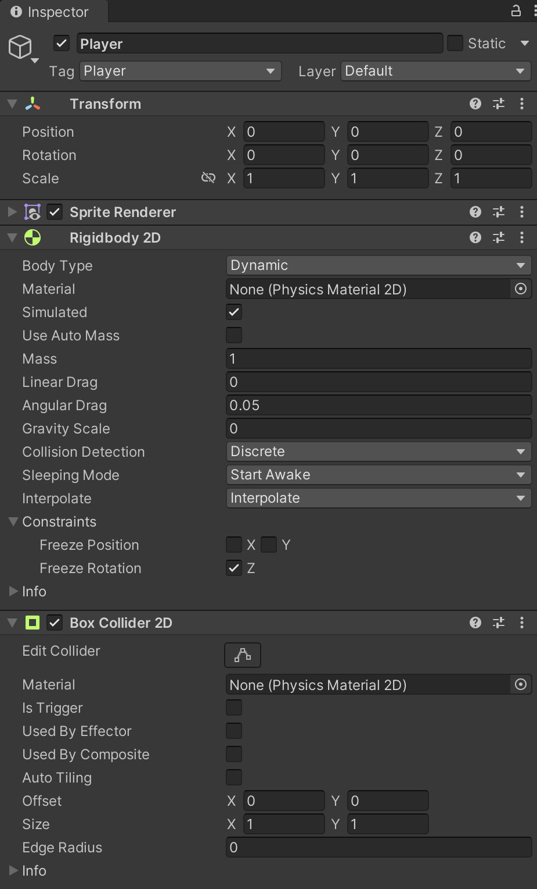

# 01. Simple Player

Using **Unity 2021.3.27f1** and **Visual Scripting 1.8.0**. The project is using the **2D Core** template.

This example demonstrates a simple 2D player character that can be moved up, down, left and right. The player is using a rigidbody so that it can collide with walls and other objects.

Start by creating a new GameObject with a `Rigidbody2D` and `BoxCollider2D` component. 

On the rigidbody set...

- **Body Type** to *Dynamic*
- **Gravity Scale** to *0*
- **Interpolate** to *Interpolate*
- **Freeze Rotation** to *Enabled*

Create a new graph with an **Object** variable named `moveSpeed` of type `Float` with an initial value of `3.0`. This variable is used in the **Get Variable** node.

The two **Input.Get Axis Raw** nodes use the `Horizontal` and `Vertical` input names. These are defined in Unity's **Input Manager** which can be modified under **Edit > Project Settings... > Input Manager**. In short, they allow the player to use the arrow keys, WASD, and the left analog stick on game controllers as input by default.

