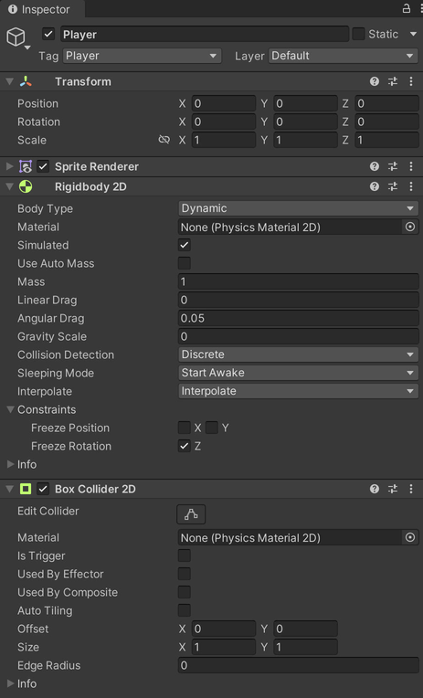
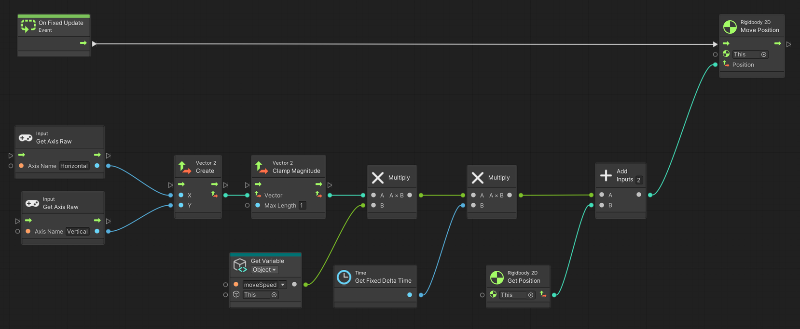

# 01. A Simple Player

> Using **Unity 2021.3.27f1** and **Visual Scripting 1.8.0**. The project is using the **2D Core** template.

This example demonstrates a simple 2D player character that can be moved up, down, left and right. The player is using a rigid body so that it can collide with walls and other objects.

Start by creating a new game object with a `Rigidbody2D` and `BoxCollider2D` component. 

On the `Rigidbody2D` set...

- `Body Type` to `Dynamic`
- `Gravity Scale` to `0`
- `Interpolate` to `Interpolate`
- `Freeze Rotation` to `true` (ticked on)

Create a new *Script Graph* with an *Object* variable[^1] named `moveSpeed` of type `Float` with an initial value of `3.0`. A `Float` is simply a number with decimals. This variable is used in the `Get Variable` node. An *Object* variable belongs to the game object the script is attached to and set through the `Variables` component on the game object.

The two `Input: Get Axis Raw` nodes use the `Horizontal` and `Vertical` input names. These are defined in Unity's *Input Manager* which can be modified under *Edit > Project Settings... > Input Manager*. In short, they allow the player to use the arrow keys, WASD, and the left analog stick on game controllers as input by default.

The *output* of `Input: Get Axis Raw` is a value between `-1.0` and `1.0`. For the `Horizontal` axis this translates to *left* and *right*, and for the `Vertical` axis it translates to *down* and *up* respectively.

A small side effect of adding the two axes together is that the player moves faster diagonally. To fix this, we can *clamp* the vector created from the `Input: Get Axis Raw` nodes. This limits the *magnitude* to `1.0` and thereby prevents the player from moving faster.

> The mathematical explanation for why the input is larger diagonally is explained by the Pythagorean theorem: <code>a2 + b2 = c2</code>. Provided both `x` and `y` is `1`, the resulting vector will have a magnitude of <code>&radic;2</code> or approximately `1.4142`.

## `On Update` and `On Fixed Update`

`On Update` is a special event that is called every frame of our game. It is where we gradually move object frame-by-frame to create the illusion of smooth movement. It is also where we may check if any buttons are pressed down. `On Update` is in perfect sync with rendering the image to the screen.

`On Fixed Update` on the other hand, is called at a fixed interval that is separate from `On Update` and does not sync with the screen. Its primary function is to simulate physics which may need to happen more frequently in complex scenarios or less often to consume less energy on mobile devices. `On Fixed Update` should generally be used whenever you are modifying a `Rigidbody` or `Rigidbody2D`, which we are here.

Detecting input, especially the exact moment a button is pressed down or released, should happen during `On Update`. This is because `On Fixed Update` does not update in-sync with the input system, and it is therefore possible to miss a button press. Since we are responding to movement input *continuously* we are less concerned with this detail.

---

[^1]: A *variable* is some data that is referenced by name. For example, `moveSpeed` references some data, in this case the number `3.0`. We know it is a number, since its data-type is `Float`. If it was some other data-type, the zeros and ones stored in the computer's memory would mean something else, like the letter 'a'.