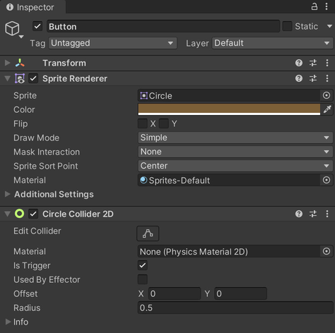
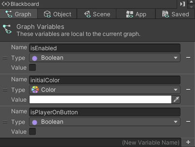
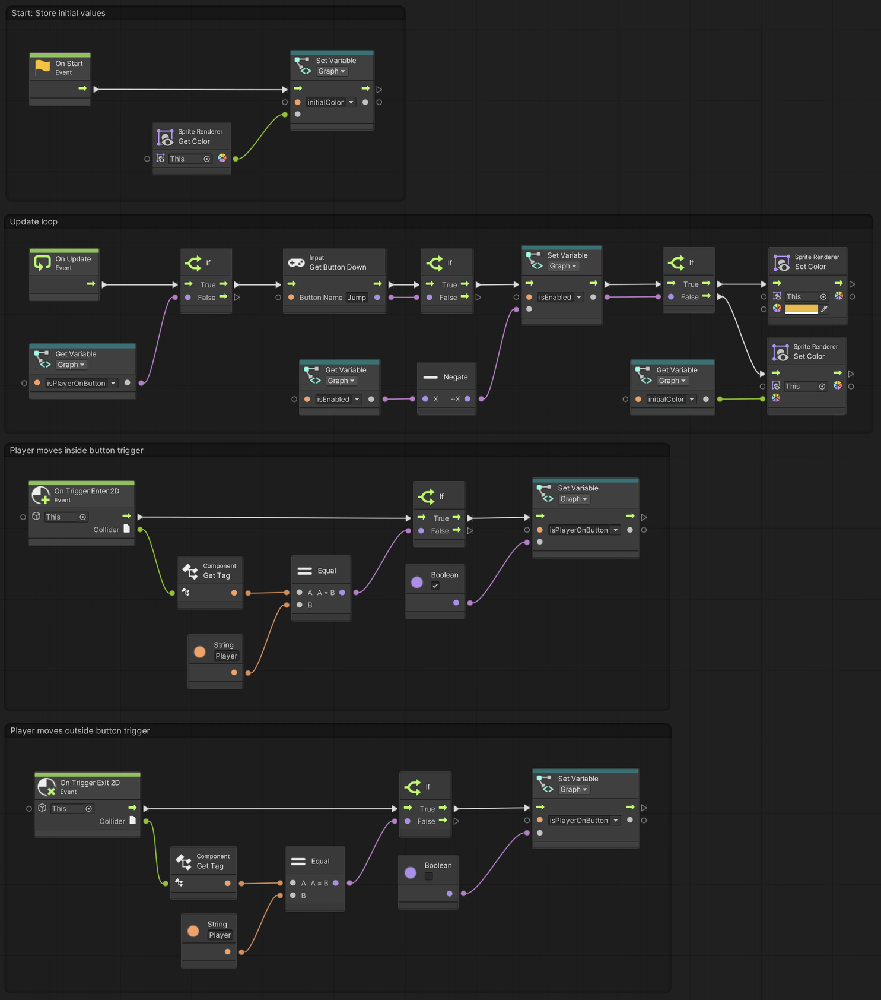

# 02. A Button

> Using **Unity 2021.3.27f1** and **Visual Scripting 1.8.0**. The project is using the **2D Core** template.

This example builds on [01. A Simple Player](../01-a-simple-player/01-a-simple-player) and demonstrates a simple button that switches between two colours.

Start by creating a game object with a sprite in a colour of your choosing. Add a `CircleCollider2D` component and set `Is Trigger` to `true`.

Next, set the *tag* of the player game object to `Player` (at the top of the *Inspector*), since we will use the tag to identify whether it is in fact the player that has entered the button's trigger. 

Create a new *Script Graph* and set up three *Graph* variables:

- `isEnabled` of type `Boolean`
- `initialColor` of type `Color`
- `isPlayerOnButton` of type `Boolean`

A `Boolean` is a type of data that can be either `true` or `false`. *Graph* variables are variables that only exist within a particular graph and cannot be accessed or modified elsewhere.

`On Start`, the button stores the initial colour of the sprite, in order to toggle between its initial colour and a "switched on" colour defined in the graph.

`On Update`, the button checks whether the `Jump` button has been pressed down. If so, the `isEnabled` variable is flipped from `true` to `false` and vice-versa. Based on the value of `isEnabled`, the button either sets its "on" or "off" colour that we stored in the `On Start` event flow. `Jump` by default maps to the *space-bar* or the *A* button on an Xbox controller. 

Finally, the `On Trigger Enter 2D` and `On Trigger Exit 2D` events check if it is a game object tagged `Player` that has entered or exited the collider. If so, the `isPlayerOnButton` variable is set to `true` or `false` respectively.

To *enter* a trigger means that some rigid body is intersecting with the trigger. This event only happens on one frame, which is when the rigid body begins intersecting with the trigger. 

