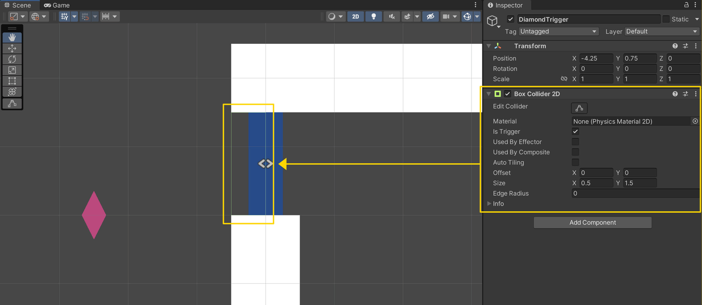
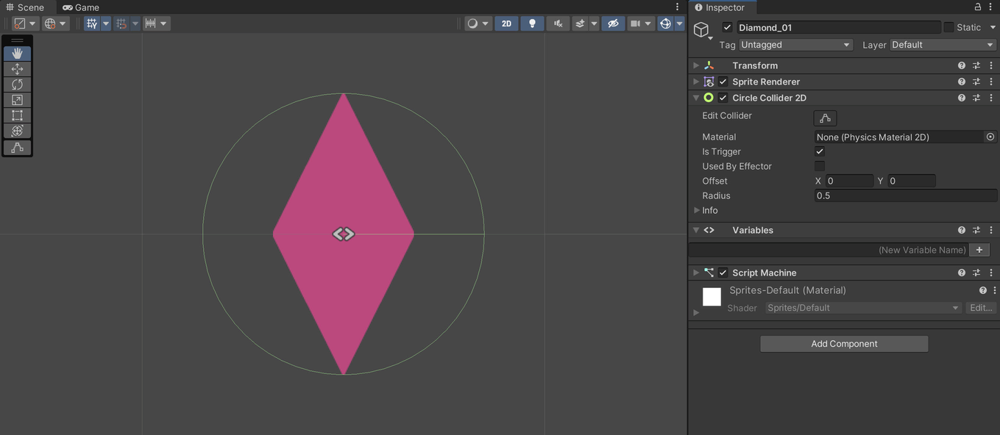
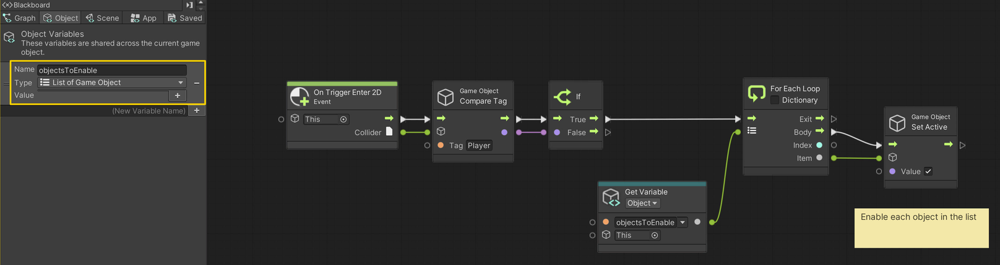
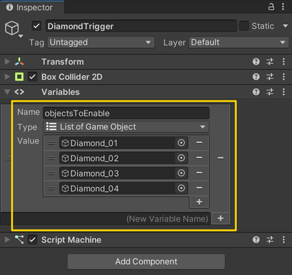
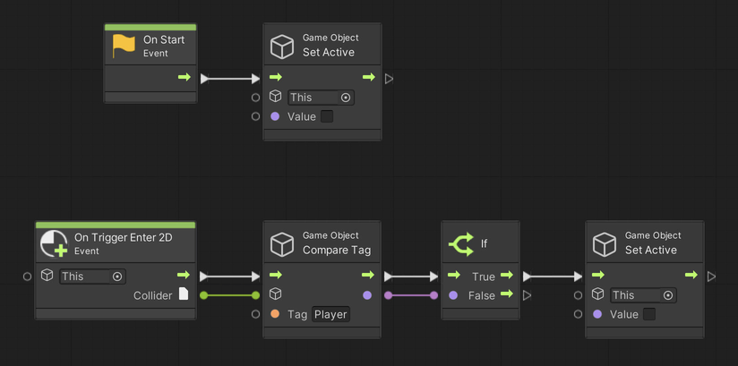

# 06. Toggling Objects

> Using **Unity 2021.3.27f1** and **Visual Scripting 1.8.0**. The project is using the **2D Core** template.

This example demonstrates how to activate and deactivate game objects as well as how to affect multiple objects using a *loop*.

## Preparing the diamond trigger

The scene is made up of a *trigger* that enables four diamond game objects when the player enters it. The trigger is shown below (note the thin green box next to the door). Make sure the `Is Trigger` property is set to `true` on the `BoxCollider2D` component.

## Preparing the diamonds

Each of the four diamonds are set up with a `CircleCollider2D` component, which is also set to act like a trigger rather than a collider.

## Creating the diamond trigger graph

Starting with the *DiamondTrigger* game object, create a new *Script Graph* that has an `List of Game Object` variable, which is an *Object* variable. Then assign each of the four *Diamond* game objects to the list on the *DiamondTrigger*.

We use the `Component: Compare Tag` node to check if it is the game object tagged `Player` that has entered the trigger. If so, we proceed with our flow.

We are then using a `For Each Loop` node to *iterate* over each of the game objects assigned to the list. One by one, each game object is disabled using the `Game Object: Set Active` node. The `Body` output of the loop is where we apply some scripting logic to each item in the list. The `Exit` output is what we do *after* the loop has finished iterating over each item in the list. The `Item` is the current object. Imagine a card deck where you pick on card from the top of the deck (the `Item`) and then draw a moustache if it is a queen (the `Body` flow logic).

## Creating the diamond graph

Now that we can enable all the diamonds when the player walks through the door, it is time to disable each of them when the player enters their trigger - as if the player is collecting diamonds!

This graph simply deactivates the game object at the beginning using the `On Start` event as well as when a game object tagged `Player` enters its trigger. You can assign the same graph to each of the diamonds. When assigning the same graph to multiple objects, be aware that you need to copy the `Variables` component as well for the *Object* variables to remain identical.

