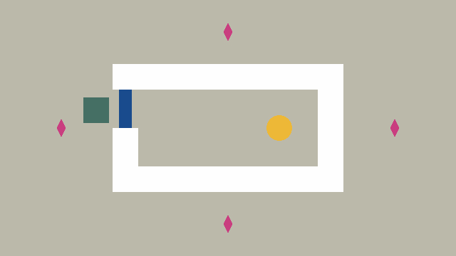

# 07. Playing Particles

> Using **Unity 2021.3.27f1** and **Visual Scripting 1.8.0**. The project is using the **2D Core** template.

This example covers how to play a `Particle System` when the player enters the trigger of one of the *Diamond* game objects.

## Create a particle system

The first step is to create a `Particle System` and parent it under the first *Diamond* game object. Make sure it is placed at the center of the *Diamond*.

Duplicate the `Particle System` and repeat for every other *Diamond*.

## Setting up the script graph

Next, open up the *Diamond* graph and add an *Object* variable called `particles` and set its type to be `Particle System`.

Then replace the `Game Object: Set Active` node with a `Sprite Renderer: Set Enabled` node and a `Circle Collider 2D: Set Enabled` node. Both should set the value to `false`. We do this to avoid disabling the particles parented under the *Diamond* and effectively hide it instead. All children of a game object are disabled if their parent is disabled. 

Finally, add a `Particle System: Play` node and assign the `particles` variable to its `Target` input.

## Assigning the Particle System

The last step is to assign the `Particle System` to the `particles` variable we just added to the *Diamond* game object.

You will need to add the `particles` *Object* variable to every other *Diamond* game object and assign the reference there as well.