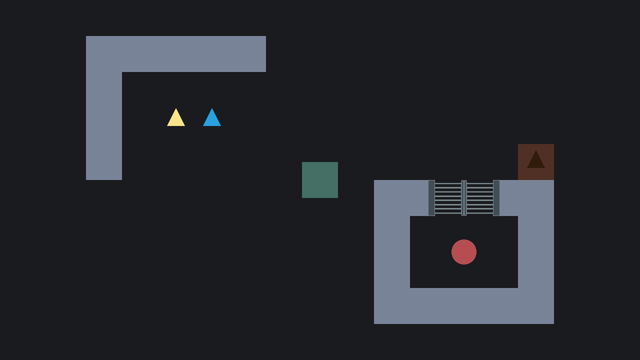

# A Simple Puzzle Game

### Through a number of small script examples you will learn about some fundamental nodes and techniques in Visual Scripting to help you get started.

---

The examples cover some of the basic nodes and principles used in scripting and do not require anymore than a knowledge about how to create and edit *Script Graphs*. If you are completely new to Visual Scripting, I recommend you watch some introductory video to help you get started on how to create graphs, add and edit nodes, and navigate the graph window.

The examples are not made as tutorials per se, but more as references or hints for how to solve specific problems. The following examples are a bit tutorial-like in nature, but does not go into detail about every single node.

Throughout the examples you will discover how to:

- Move a player using physics
- Switch buttons on and off
- Open and close doors
- Play animations and particle effects
- Use keys and locks
- Drag objects around the world
- Make an inventory

	

	
	

The final project can be downloaded from here: [A Simple Puzzle Game.zip](./A Simple Puzzle Game.zip)

---

The project uses emojis designed by [OpenMoji](https://openmoji.org) – the open-source emoji and icon project. License: [CC BY-SA 4.0](https://creativecommons.org/licenses/by-sa/4.0)
