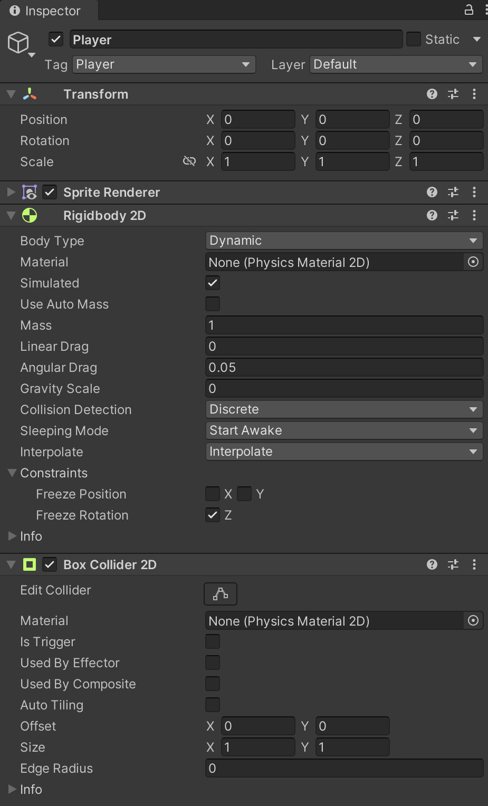
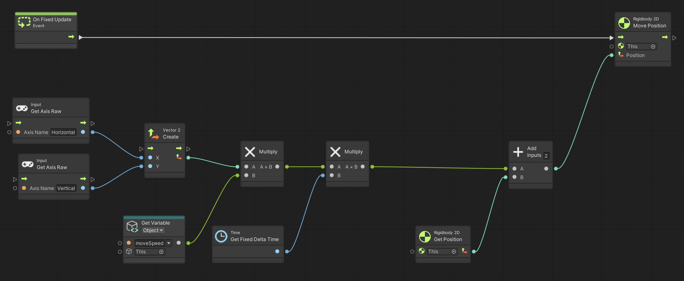

Using **Unity 2021.3.27f1** and **Visual Scripting 1.8.0**. The project is using the **2D Core** template.

This example demonstrates a simple 2D player character that can be moved up, down, left and right. The player is using a rigid body so that it can collide with walls and other objects.

Start by creating a new GameObject with a `Rigidbody2D` and `BoxCollider2D` component. 

On the `Rigidbody2D` set...

- **Body Type** to *Dynamic*
- **Gravity Scale** to *0*
- **Interpolate** to *Interpolate*
- **Freeze Rotation** to *Enabled*

Create a new graph with an **Object** variable named `moveSpeed` of type `Float` with an initial value of `3.0`. This variable is used in the **Get Variable** node.

The two **Input.Get Axis Raw** nodes use the `Horizontal` and `Vertical` input names. These are defined in Unity's **Input Manager** which can be modified under **Edit > Project Settings... > Input Manager**. In short, they allow the player to use the arrow keys, WASD, and the left analog stick on game controllers as input by default.

Note that we are using **Fixed Delta Time** here, since we are also using **Fixed Update**, which should generally be used whenever you are modifying physics objects (things with rigid bodies and colliders). 

When detecting button presses, you generally should be using **Update** rather than **Fixed Update**, since you may miss a press when using **Fixed Update** because it is not guaranteed to be called every time **Update** is called. In that situation you may store that the button was pressed in a variable, and then check and reset the variable in **Fixed Update**. However, sometimes it may be fine to call **Add Force** on a rigid body from within **Update** to make a character jump, since the force is only added once.

The reason why detecting input here is acceptable, is because we are *continuously* checking the state of moving the character, and the character is only asked to move in **Fixed Update** anyway.

