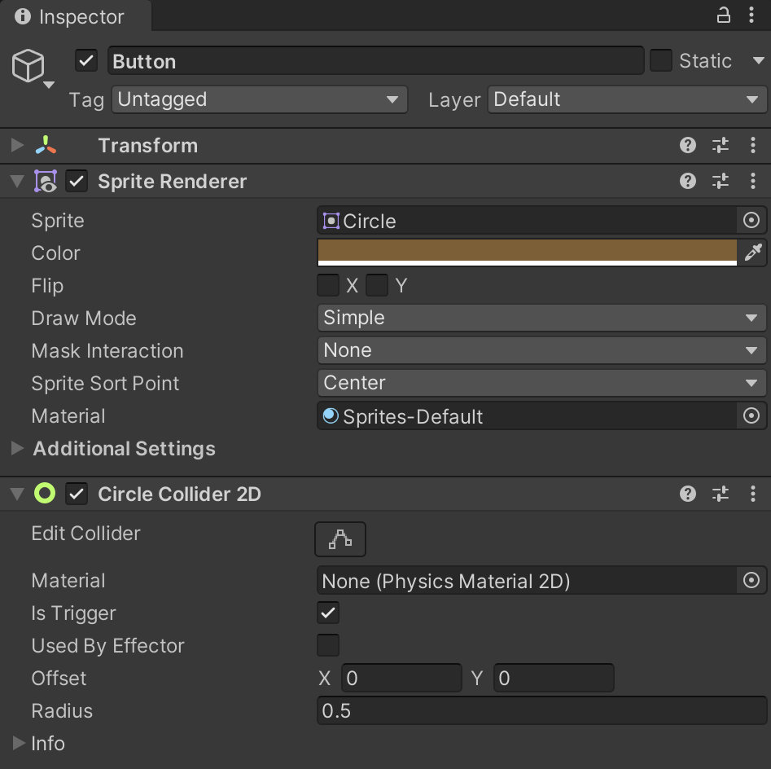

Using **Unity 2021.3.27f1** and **Visual Scripting 1.8.0**. The project is using the **2D Core** template.

This example builds on the **01. Simple Button** example, and demonstrates a simple button that switches between two colors.

Start by creating a GameObject with a sprite in a dark brown color. Add `CircleCollider2D` component and set **Is Trigger** to *Enabled*.

Next, set the **Tag** of the player GameObject to *Player*, since we will use the tag to identify whether it is in fact the player that has entered the button's trigger.

For this graph, set up three **Graph** variables:

- `isEnabled` of type `Boolean`
- `initialColor` of type `Color`
- `isPlayerOnButton` of type `Boolean`

**On Start**, the button stores the initial color of the sprite, in order to toggle between its initial color and a "switched on" color defined in the graph.

**On Update**, the button checks whether the `Jump` button has been pressed down. If so, the `isEnabled` variable is flipped from `true` to `false` and vice-versa. Based on the value of `isEnabled`, the button either sets its "on" or "off" color that we stored On Start.

Finally, the **On Trigger Enter/Exit 2D** events check if it is a GameObject tagged *Player* that has entered or exited. If so, the `isPlayerOnButton` variable is set to `true` or `false` respectively.

