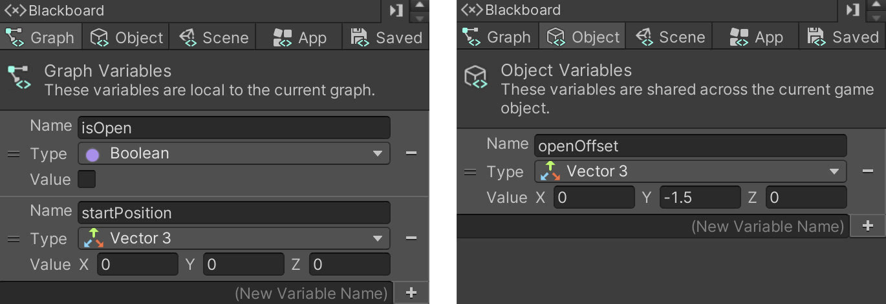

# 03. Opening a Door

> Using **Unity 2021.3.27f1** and **Visual Scripting 1.8.0**. The project is using the **2D Core** template.

In this example, we will send a **Custom Event** from the button to the door, which switches the door between being open and closed. An event is some occurrence in the system that other parts of the system can respond to. A real-world analogy would be you taking your pasta off the stove (the response) when an alarm clock rings (the event).

Create a new **Script Graph** for the door and create two **Graph** variables as well as one **Object** variable that we can adjust in the Inspector.

The two **Graph** variables should be named...

- `isOpen` of type `Boolean`
- `startPosition` of type `Vector3`

The **Object** variable should be named `openOffset` and be of type `Boolean`. In this example, the `openOffset` is set to a value of `X: 0`, `Y: -1.5`, `Z: 0`.

In the graph, we then use a **Custom Event** node that responds to an event called `ToggleDoor`. We will *trigger* this event later from our button.

## The Door Graph

For the button, we add an **Object** variable named `door`. We then assign our *door* game object to the button in the Inspector.

Finally, we use a **Trigger Custom Event** node to send the `ToggleDoor` event to the *door* game object. The change in the button's graph from example 02 is highlighted in yellow.

## The Button Graph

