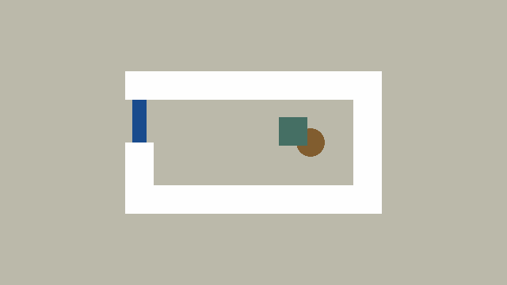
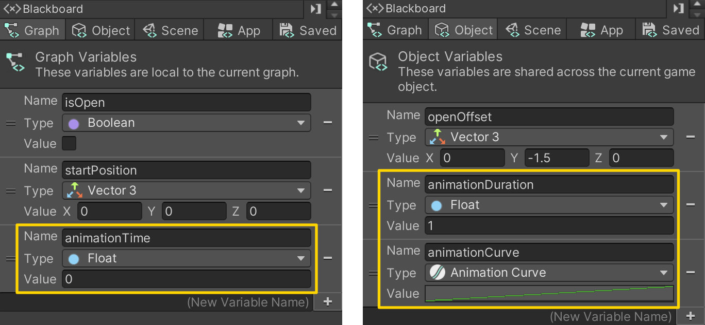
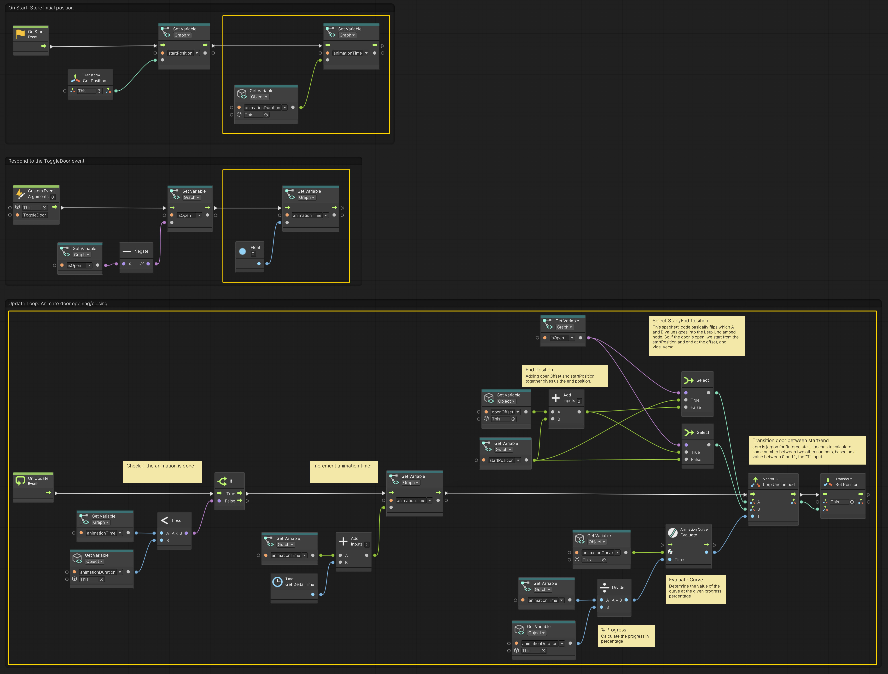
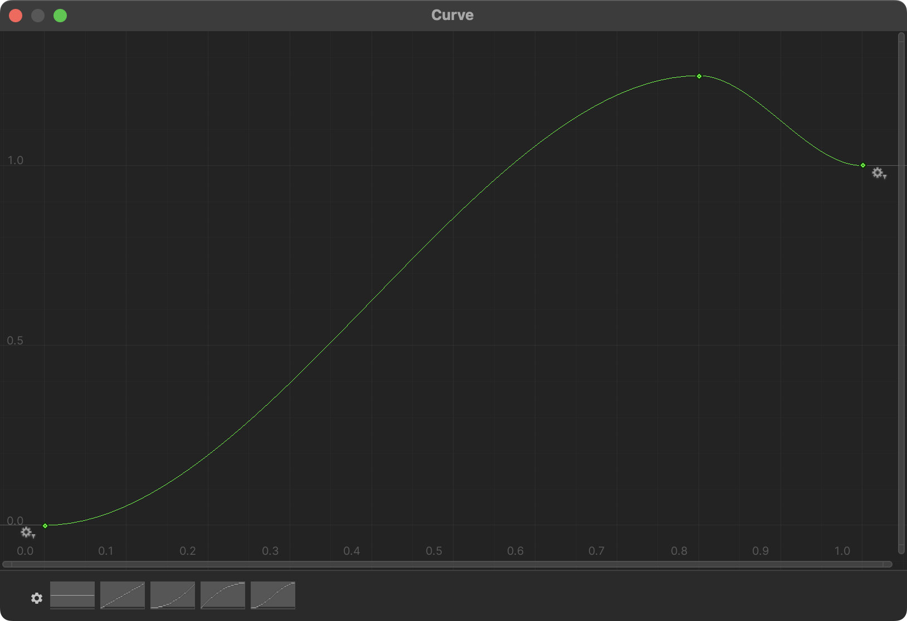

# 04. Animating the Door

> Using **Unity 2021.3.27f1** and **Visual Scripting 1.8.0**. The project is using the **2D Core** template.

In this example we will animate the door using only scripts, so that it moves from one position to another with a smooth motion.

Start by adding two additional **Object** variables to the door graph:

- `animationDuration` of type `Float`
- `animationCurve` of type `Animation Curve`

We can use the **Animation Curve** to control easing of the door, or even give it a bounce effect! Together with the `animationDuration` we get complete control of the motion from start to end.

In addition, we add a **Graph** variable named `animationTime` of type `Float`. We will use this variable to remember how far the animation has progressed. Initially, we set the value `animationTime` to be the same as `animationDuration`, thereby assuming that the animation is "done" when our game starts. The animation is then restarted whenever the door is toggled.

A lot is going on in this graph, so take a deep breath, and let me try to walk you through it.

Starting from the top, the **On Start** simply sets the `animationTime` to the value of `animationDuration`. This makes our **On Update** flow stop at the first **If** node it encounters and prevents any movement. In other words, no animation is happening.

The **Custom Event** now sets the `animationTime` to `0`. This has the effect of restarting the animation and starting from the beginning of the transition between open and closed. As you can see in the GIF above, the animation "jumps" when the player is pressing the button rapidly. This is because the animation always goes to zero and begins from either the open or closed position, before moving to its desired position.

The **On Update** flow first checks if the `animationTime` is less than than `animationDuration`. If it is, then it increments the `animationTime` effectively making it a timer that increase in real time.

The upper part of the second half, determines where the door should begin its movement and where it should move to. The `startPosition` is where the door is when it is closed, and the open position is `startPosition + openOffset` (adding the two vectors together).

The **Select** node then uses the `isOpen` variable to decide which values goes to the `A` and `B` inputs of the **Lerp Unclamped** node. If you look closely at the two **Select** nodes, you will see that the inputs are simply flipped. The result is that the position of where the door begins and ends its animation, is dependant on whether `isOpen` is `true` or `false`.

The **Lerp Unclamped** node then takes the start and end position as inputs, together with a special value called `T`. If you imagine a line, the value of `T` describes how far along the line the *output* should be. A value of `0.0` means it will be right at the beginning, and a value of `1.0` means at the end. Any number in between will be a percentage between the two vectors. The word *unclamped* means that the value of `T` can past `1.0`, like `1.5`, which would make the door overshoot its target. Try making a curve like the one below to see what I mean.

The final piece of the puzzle, is to *evaluate* the **Animation Curve**. That means given some value along the X-axis (or time axis), the curve will *evaluate* to some value along the Y-axis. So we divide the `animationTime` with the `animationDuration` to get a percentage of how much the animation has progressed, and use this number to *evaluate* the curve along the X-axis - imagine time moving from left to right along the curve.