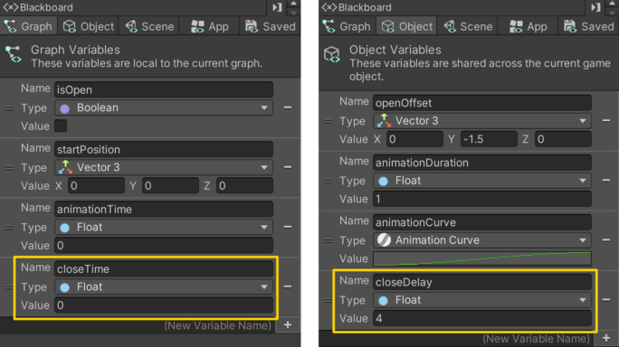
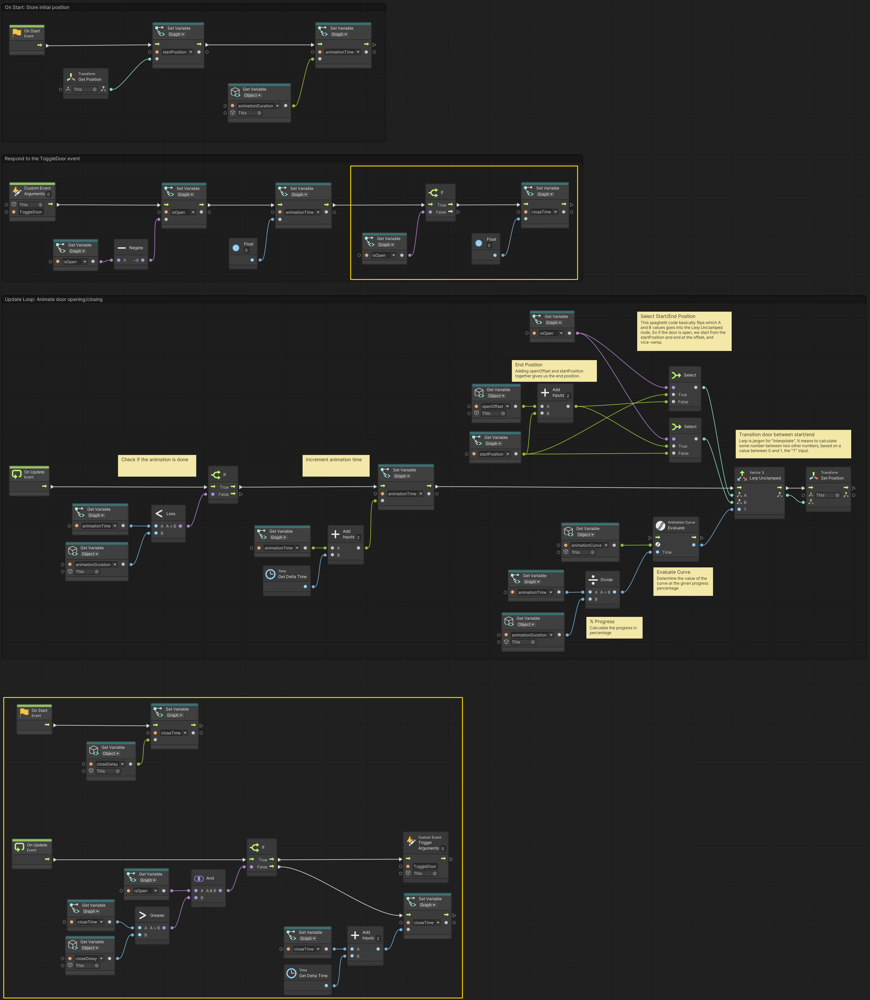

# 05. Auto Closing Door

> Using **Unity 2021.3.27f1** and **Visual Scripting 1.8.0**. The project is using the **2D Core** template.

This example extends previous examples, in particular example [03. Opening a Door](../03-opening-a-door/03-opening-a-door) and [04. Animating the Door](../04-animating-the-door/04-animating-the-door). 

In this example, we will add a delay to the door that will make it close automatically after a certain amount of time has passed.

Open up the *Door* graph and add two new variables:

- `closeTime` of type `Float` as a *Graph* variable
- `closeDuration` of type `Float` as a *Object* variable

Start by adding the logic at the end of the `Custom Event` that sets the `closeTime` variable to `0` if the `isOpen` variable is `true` (highlighted at the top).

At the bottom of the graph is the new flow that will close the door after a certain amount of time has passed (highlighted).

The `On Start` event flow just sets the `closeTime` to the `closeDuration` so that it does not do anything initially.

The `On Update` event flow then use an `And` node to check if both `A` *and* `B` is `true`. To be specific, if `isOpen` is `true` *and* if `closeTime` is greather than `closeDuration` then we trigger the custom event called `ToggleDoor`. If not, then we increment the `closeTime` variable by the *delta time* to make it behave like a timer.

Nodes like `And`, `Or`, `Less`, `Greater` are what is known as *boolean expressions*. They are statements that *evaluate* to either `true` or `false` depending on their input. They are logical expressions. Some examples:

- `true AND true` is `true`
- `true AND false` is `false`
- `true OR false` is `true`
- `false OR false` is `false`
- `11 > 7` is `true` (greater than)
- `8 ≥ 8` is `true` (greather than or equal to)
- `5 < 9` is `false` (less than)
- `3 ≤ 1` is `true` (less than or equal to)

You may note that the button does not automatically switch color! I will leave it to you to figure out. *Hint:* You may use a `Custom Event` :)