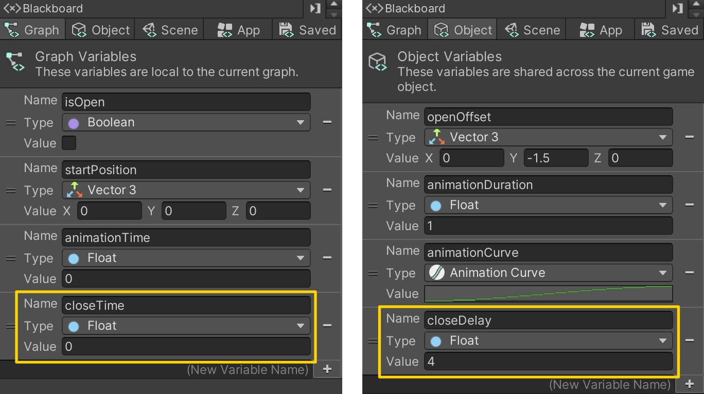

# 05. Auto Closing Door

> Using **Unity 2021.3.27f1** and **Visual Scripting 1.8.0**. The project is using the **2D Core** template.

This example extends previous examples, in particular example [03. Opening a Door](../03-opening-a-door/03-opening-a-door) and [04. Animating the Door](../04-animating-the-door/04-animating-the-door). 

In this example, we will add a delay to the door that will make it close automatically after a certain amount of time has passed.

Open up the door graph and add two new variables:

- `closeTime` of type `Float` as a **Graph** variable
- `closeDuration` of type `Float` as a **Object** variable

Start by adding the logic at the end of the **Custom Event** that sets the `closeTime` variable to `0` if the `isOpen` variable is `true`. Highlighted in yellow at the top.

At the bottom of the graph is the new logic that will close the door after a certain amount of time has passed - also highlighted in yellow.

**On Start** just sets the `closeTime` to the `closeDuration` so that it doesn't do anything initially.

**On Update** then use an **And** node to check if two *boolean expressions* are `true`. In other words, *if both A and B are true, then the output is true*. To be specific, if `isOpen` is `true` *and* if `closeTime` is greather than `closeDuration` then we trigger the custom event called `ToggleDoor`. If not, then we increment the `closeTime` variable by the *delta time* to make it behave like a timer.

You may note that the button does not automatically switch color! I will leave it to you to figure out. **Hint:** You may use custom events :)

