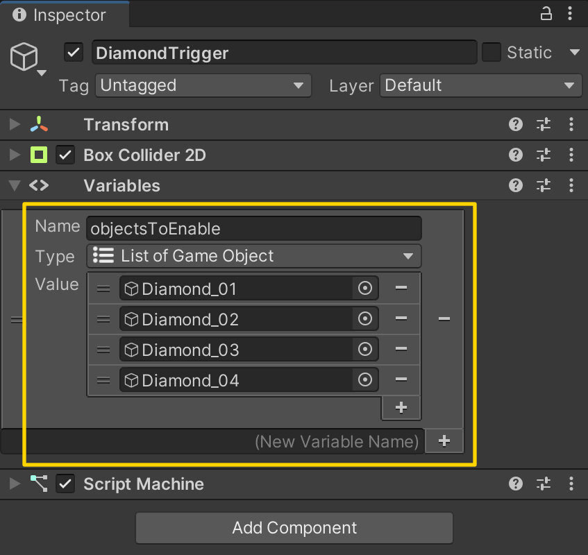

# 06. Toggling Objects

> Using **Unity 2021.3.27f1** and **Visual Scripting 1.8.0**. The project is using the **2D Core** template.

This example demonstrates how to activate and deactivate game objects as well as how to affect multiple objects using a *loop*.

## Preparing the Diamond Trigger

The scene is made up of a *trigger* that enables four diamonds when the player enters it. The trigger is shown below (note the thin green box next to the door). Make sure the **Is Trigger** property is set to `true` on the `BoxCollider2D` component.

## Preparing the Diamonds

Each of the four diamonds are set up with a `CircleCollider2D`, which is also set to act like a trigger.

## Creating the Diamond Trigger Graph

Starting with the **DiamondTrigger**, create a new **Script Graph** that has an **List of Game Object** variable, which is an **Object** variable. Then assign each of the four **Diamond** game objects to the list on the **DiamondTrigger**.

We use the **Compare Tag** node to check if it is the game object tagged `Player` that has entered the trigger. If so, we proceed with our logic.

We are then using a **For Each Loop** node to *iterate* over each of the game objects assigned to the list. One by one, each game object is disabled using the **Set Active** node. The *body* of the loop is where we apply logic to each item in the list. The *exit* is what we do *after* the loop has finished iterating over each item in the list.

## Creating the Diamond Graph

Now that we can enable all the diamonds when the player walks through the door, it is time to disable each of them when the player enters their trigger - as if the player is collecting diamonds!

This graph simply deactivates the game object **On Start** as well as when a game object tagged `Player` enters its trigger. You can assign the same graph to each of the diamonds.

