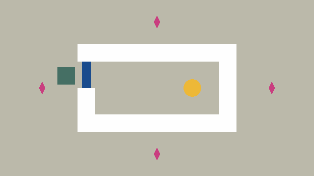
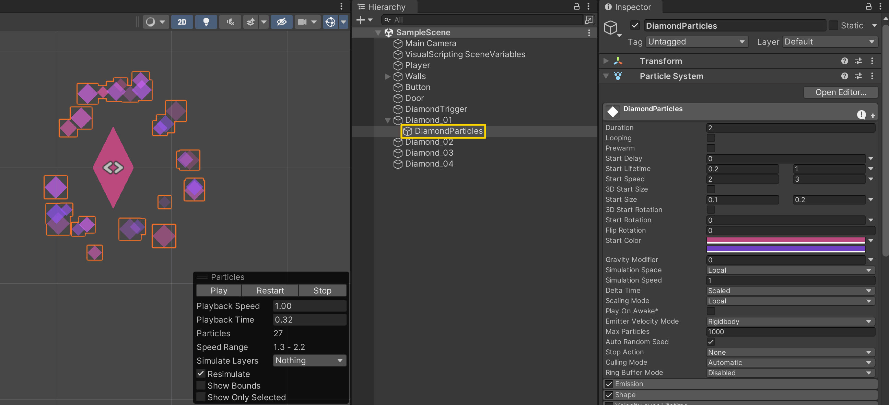
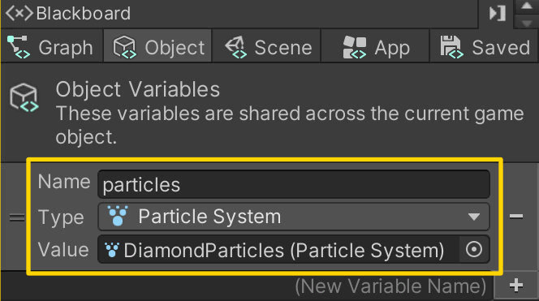
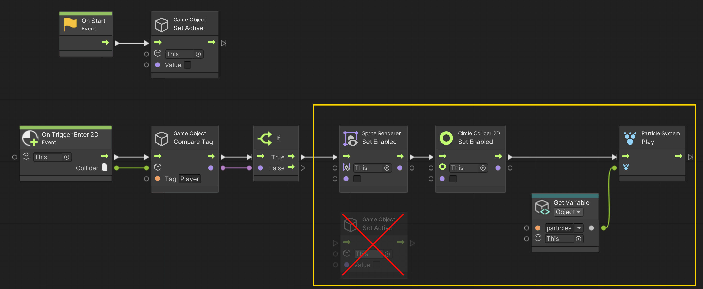

# 07. Playing Particles

> Using **Unity 2021.3.27f1** and **Visual Scripting 1.8.0**. The project is using the **2D Core** template.

This example covers how to play a **Particle System** when the player enters the trigger of one of the *Diamond* game objects.

## Create a Particle System

The first step is to create a **Particle System** and parent it under the first *Diamond* game object. Make sure it is placed at the center of the *Diamond*.

Duplicate the **Particle System** and repeat for every other *Diamond*.

## Setting Up the Script Graph

Next, open up the *Diamond* graph and add an **Object** variable called `particles` and set its type to be `Particle System`.

Then replace the **Game Object: Set Active** node with a **Sprite Renderer: Set Enabled** and **Circle Collider 2D: Set Enabled** node. Both should set the value to `false`. We do this, to avoid disabling the particles parented under the *Diamond*. 

Finally, add a **Particle System: Play** node and assign the `particles` variable to its *Target* input.

## Assigning the Particle System

The last step is to assign the **Particle System** to the `particles` variable we just added to the *Diamond* game object.

You will need to add the `particles` **Object** variable to every other *Diamond* game object and assign the reference there as well.