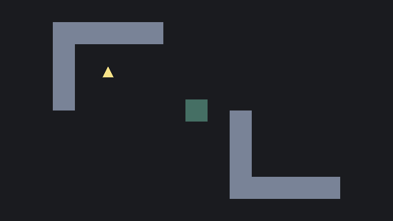
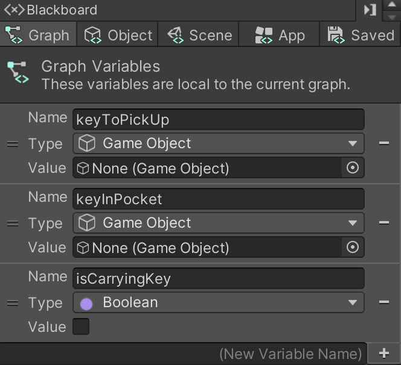
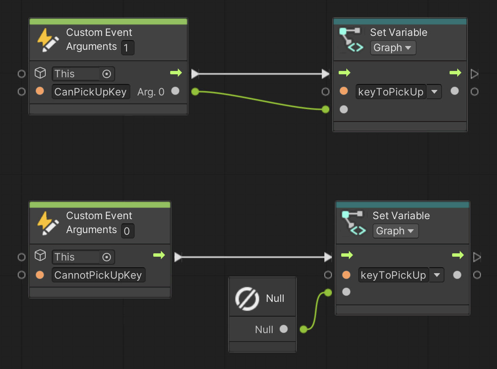
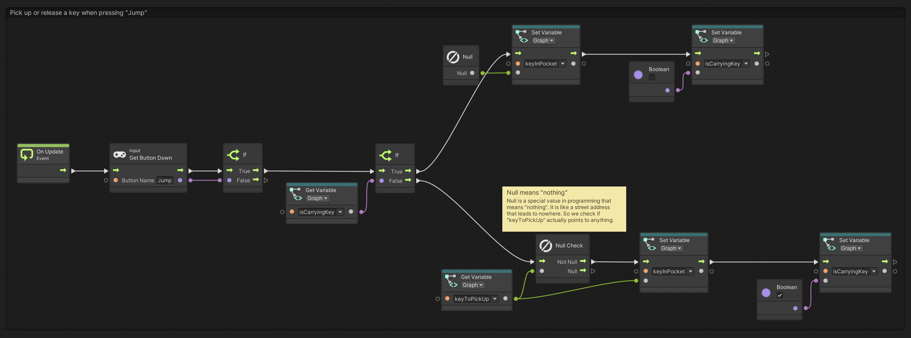
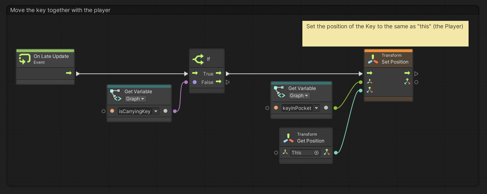

# 08. Picking Up A Key

> Using **Unity 2021.3.27f1** and **Visual Scripting 1.8.0**. The project is using the **2D Core** template.

Picking up keys and other items is central to many games. Key can be used to unlock doors, and items in general are used for a ton of stuff like trading, acquiring new abilities, and many other things.

This example shows how to pick up a key, make it follow the player around, and drop the key again at any location. The next example will show how to place a key at a specific location.

## The Key

First, create a new game object called *Key*, assign a `BoxCollider2D` component and set its **Is Trigger** property to `true`. Then assign a new **Script Graph**. The *Key* is the yellow triangle in the GIF above.

We want the *Key* to trigger a *custom event* when the *Player* enters and exits the trigger. The *event* will let the *Player* know that a *Key* can be picked up. For the `CanPickUpKey` *event* we use an argument `Arg. 0` to send a reference to **This** particular game object - that is, the *Key*. When the *Player* then responds to the *event*, it will know exactly which *Key* it is that can be picked up.

## Picking Up The Key

The second piece of the puzzle, is to let the *Player* handle what to do whenever a *Key* can be picked up.

In the *Player* script graph, start by creating three **Graph** variables. We will use these variables to remember which *Key* can be picked up, which *Key* the *Player* might currently be carrying, and whether the *Player* is in fact carrying a *Key*. The three variables are:

- `keyToPickUp` of type `Game Object`
- `keyInPocket` of type `Game Object`
- `isCarryingKey` of type `Boolean`

The first step is to respond to the *events* triggered by the *Key*. So add the following nodes to the *Player* graph. Remember that they `CanPickUpKey` event is triggered with 1 argument, so we must also receive 1 argument here: `Arg. 0`. Fortunately, we want this argument, because it lets us know which *Key* triggered the event. We save this information in the `keyToPickUp` variable.

The `CannotPickUpKey` event does not pass any argument. So instead, we set the `keyToPickUp` to `Null`. `Null` is a special value that means *nothing*. Think of it like a street address to nowhere. 

The next piece of the *Player* logic, is to handle picking up and letting go of *Keys*. We first check if the `Jump` button is pressed and if it is, we determine if we are currently carrying a *Key*. If we are, then we let go of the *Key* by setting `keyInPocket` to `Null` and `isCarryingKey` to `false`. If we are not carrying a *Key*, then we check if we currently have a *Key* to pick up by checking if `keyToPickUp` is **not** `Null`. If it is not `Null`, then we can put the *Key* in our pocket.

The final piece of the *Player* logic we want to add, is the logic that moves the *Key* together with the *Player* whenever the *Player* is carrying a *Key*.

We use **On Late Update** here because we want to ensure that the logic that moves the *Key* happens *after* we have moved the *Player*. In Unity, all *events* like **On Start**, **On Update** and **On Late Update** happen at specific times and in a specific order. The ones you will encounter most often happen in the follow order:

1. **On Start** (only once)
2. **On Enable** (any time a component or game object is enabled)
3. **On Update** (every frame)
4. **On Late Update** (every frame)
5. **On Disable** (any time a component or game object is disabled)

You can see the order of all Unity's event functions here: [https://docs.unity3d.com/Manual/ExecutionOrder.html](https://docs.unity3d.com/Manual/ExecutionOrder.html).

