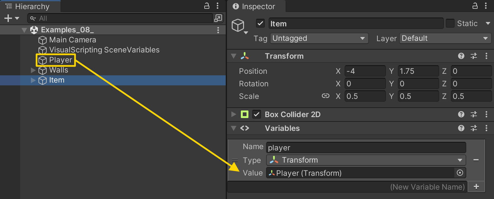
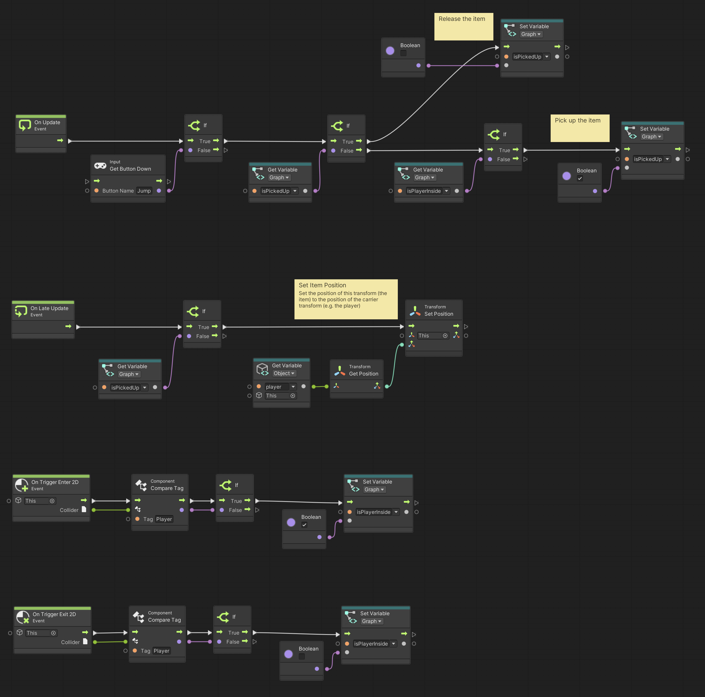

# 08. Picking Up Items

> Using **Unity 2021.3.27f1** and **Visual Scripting 1.8.0**. The project is using the **2D Core** template.

Picking up items is central to many games. Items can be used to unlock doors, trade things, acquire new abilities, and many other things.

This example shows how to pick up an item, make it follow the player around, and drop the item again at any location.

First, create a new game object called *Item*, assign a `BoxCollider2D` component and set its **Is Trigger** property to `true`. Then assign a new **Script Graph**.

In the graph, we need three variables:

- `isPlayerInside` of type `Boolean` as a **Graph** variable
- `isPickedUp` of type `Boolean` as a **Graph** variable
- `player` of type `Transform` as an **Object** variable

In the Inspector, we then assign the *Player* game object to the `player` variable.

Finally, we set up our *Item* graph.

Notice that we used both a node called **On Update** and **On Late Update**. The difference is that within a single frame, *all* **On Update** events happen *before* any of the **On Late Update** events.

We use the **On Late Update** event to ensure that the *Player* has changed its position, *before* we update the *Item's* position. If we didn't, we might end in a situation where you would see a small stutter whenever the *Player* moved, because the *Item* would move *before* the *Player*. What we want, is for the *Item* to always move *after* the *Player*.