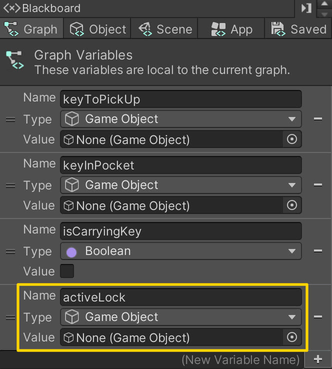
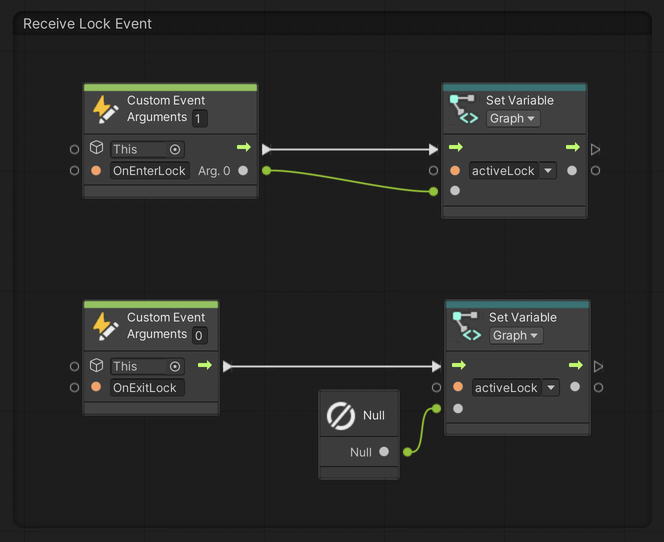
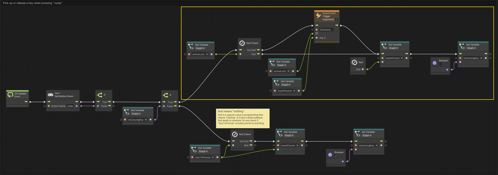

# 09. Placing Keys In Locks

> Using **Unity 2021.3.27f1** and **Visual Scripting 1.8.0**. The project is using the **2D Core** template.

Continuing from example [08. Picking Up A Key](../08-picking-up-a-key/08-picking-up-a-key), we will now add a *Lock* the *Key* can be placed in.

## The lock

The first step is to create a new game object that will act as the *Lock*. The *Lock* should have two `BoxCollider2D` components: One for detecting when the *Player* is nearby and one to that prevents the *Player* from walking through it.

The `BoxCollider2D` that detects when the *Player* is nearby should be larger than the *Lock* itself and set to be a trigger. The inner collider should simply match the graphics and is *not* set as a trigger.

The *Lock* uses two `Trigger Custom Event` nodes, `OnEnterLock` and `OnExitLock`, which will be received by the *Player*.

The *Lock* also *receives* a `Custom Event`: `OnUnlock`, which will be *triggered* by the *Player*. This flow will then receive the *Key* and set its position to the same as the *Lock* and disable the collider on the *Key* to prevent further interaction with it.

Notice that we are using a *Flow* variable in the custom event flow. A *Flow* variable is a temporary variable that can only be accessed within the current flow. The variable must have been *set* before it can be read using `Get Variable`. The main reason for using it here, is to prevent dragging long connections across the flow, which could become difficult to read at a glance.

## The player

On the *Player* graph, add an additional *Graph* variable called `activeLock` of type `Game Object`. This is where we will store which *Lock* we are currently nearby.

The first thing to set up, are the two *event* receivers for `OnEnterLock` and `OnExitLock`. The `OnEnterLock` event will send a reference to the *Lock* so that we can later communicate with it.

The second and last bit, is to *trigger* the `OnUnlock` event on the *Lock* when one is nearby. That is, if some *Lock* has sent an event to the *Player* about that they entered the *Lock's* trigger.

Modify the flow where the *Player* previously released the *Key* to also include the event that potentially tells the *Lock* to unlock (the part highlighted in yellow).

Right now, any *Key* can be used on any *Lock*. In the next example, we will look at how to restrict *Keys* to only work with certain *Locks*.

As for opening a door, I will let you figure that out :)