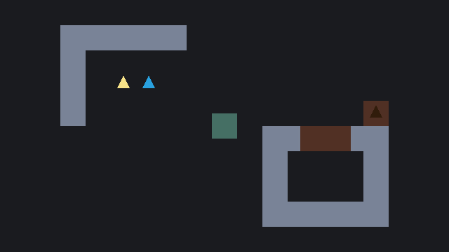
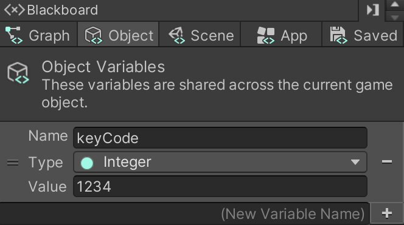
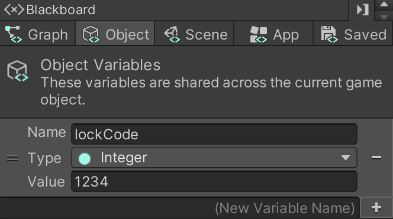
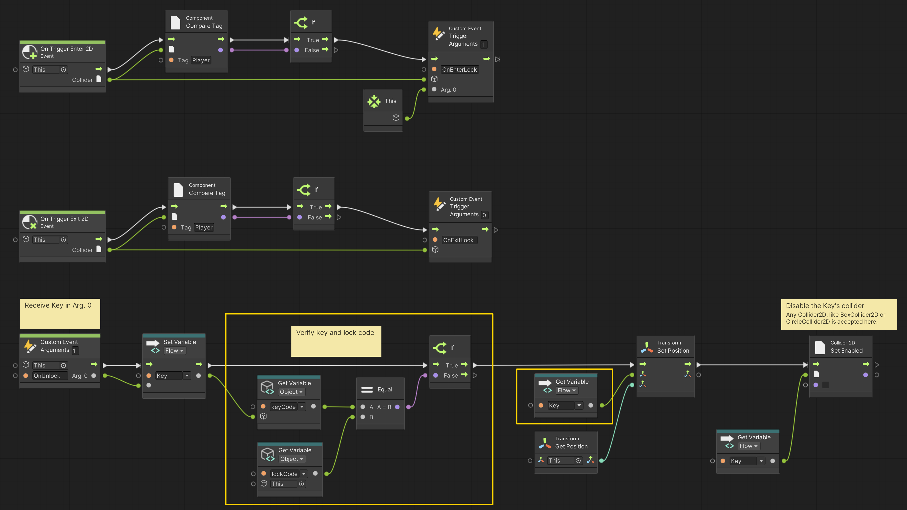

# 10. Restricting Keys and Locks

> Using **Unity 2021.3.27f1** and **Visual Scripting 1.8.0**. The project is using the **2D Core** template.

*Keys* that can open *Locks* are fine, but given that any *Key* can open any *Lock* may not always be desirable.

In this example, we will look at how to restrict access, so that only certain *Keys* will work in certain *Locks*.

## The Key

Returning to the *Key's* script graph we only need to add a single **Object** variable called `keyCode` of type `Integer`. Give it a value of `1234`. An `Integer` is simply a natural number, meaning it has no decimals. 

## The Lock

Continuing with the *Lock's* graph we also need to add an **Object** variable. Name this variable `lockCode` and set its type to `Integer` and like for the *Key*, set its value to `1234`.

When the `OnUnlock` event is called on the *Lock*, we will compare the `keyCode` and the `lockCode` variables to see if they match. If they do we will continue with the rest of the flow. If not, we do nothing.

The changes are highlighted in yellow.

## The Wrong Key

Duplicate the *Key* and set the `keyCode` variable's value to something other than `1234`. For example, `4321`. In the demo at the top, the yellow *Key* has the `keyCode` that matches the *Lock*, whereas the blue *Key* has the wrong `keyCode`.