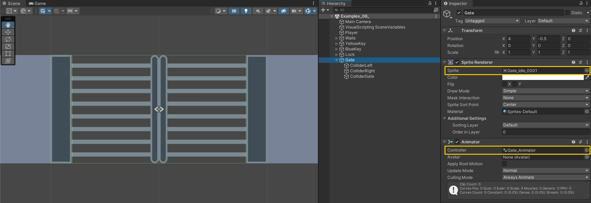
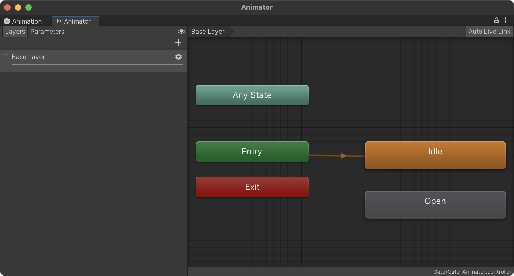
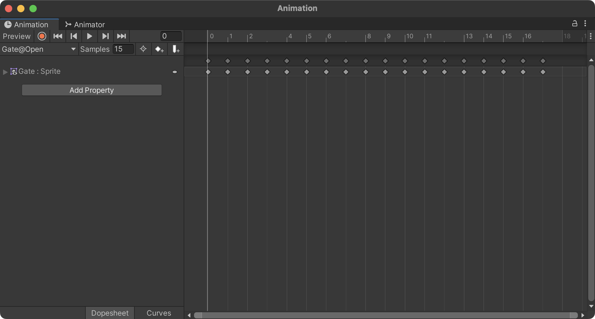
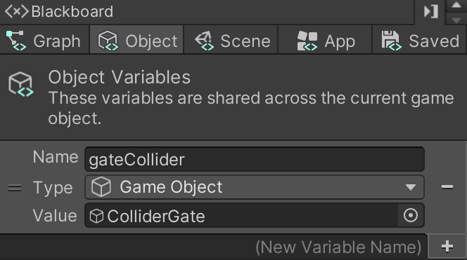

# 11. Play an Animation

> Using **Unity 2021.3.27f1** and **Visual Scripting 1.8.0**. The project is using the **2D Core** template.

This example uses the `Animator` component to play an `AnimationClip`. If you are unfamiliar with setting up Animation Clips and Animator Controllers, I recommend you find a tutorial elsewhere, for example at Unity's own learning site:

- [Animator Controllers](https://learn.unity.com/tutorial/animator-controllers-2019-3)
- [Introduction to Sprite Animations](https://learn.unity.com/tutorial/introduction-to-sprite-animations)

For this example, I have prepared a small Unity Package which contains two sprite animation clips and an `Animator Controller` with the necessary states set up. You can download the package here: [gate.unitypackage](./gate.unitypackage).

While this example is using a 2D sprite animation, the steps for controlling animations are the same.

## Setting up the Gate Game Object

In this example I will be using an animation of a gate opening.

The first step is to set up a new game object with an `Animator` component that has an `Animator Controller` assigned. 

In addition to the game object, I have added three child game objects that each have a `BoxCollider2D`. They act as colliders for the edge of the gate and the gate itself.

## The Animator Controller

The `Animator Controller` is set up with two *states*: *Idle* and *Open*. The *Idle* state is the default state (indicated by the orange color) and is simply a single frame. The *Open* state is a short sprite animation of the gate opening.

We will use the names of the *States*, rather than the animation clips themselves, later in our Script Graph. 

Below is the *Gate@Open* animation clip in the **Animation** window.

## The Gate Script Graph

For the *Gate's* script graph, we just create a **Custom Event** node that can be triggered by another script.

We then use an **Animator: Play (State Name)** node to play an animation by providing it the name of the *state* we would like to play. In this case, we use the value `Open`.

In addition, we disable the collider for the gate so that the player can walk through it. The gate collider is set up using an **Object** variable called `gateCollider` and is of type `Game Object`.

