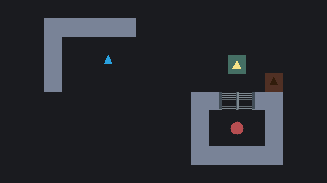
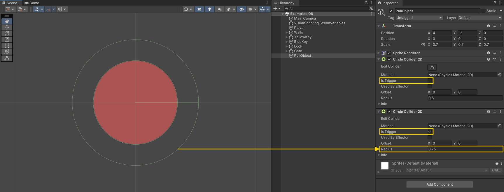
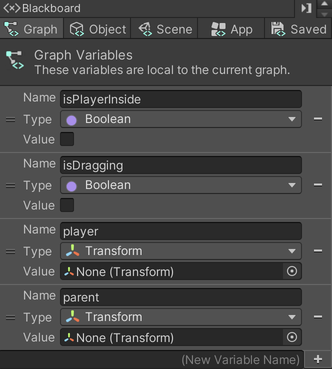
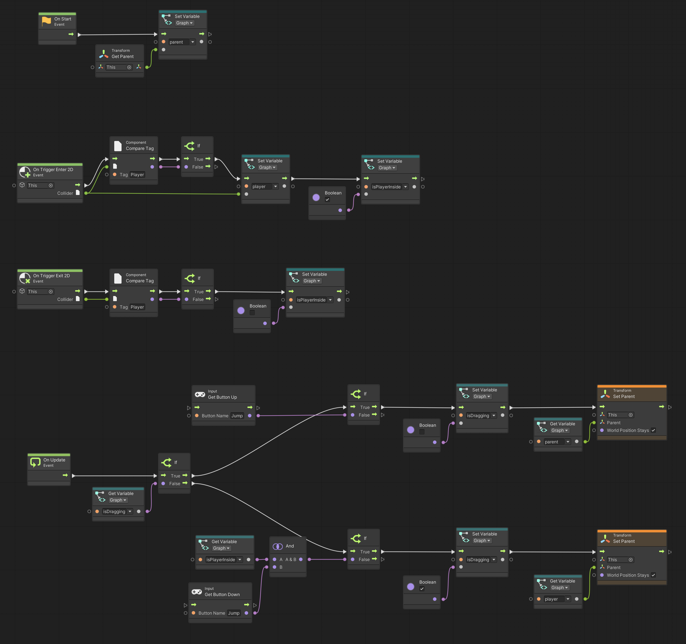

# 12. Pull an Object

> Using **Unity 2021.3.27f1** and **Visual Scripting 1.8.0**. The project is using the **2D Core** template.

Moving objects around the scene can be a useful game mechanic. Since we have based the player on physics, we can utilise a neat trick. The trick is that any game object with a collider, which is a child of a game object with a `Rigidbody`, makes the collider a part of the `Rigidbody`.

With this in mind, we can make another object move around with the player and have the player and object bump into things, as if they were one. We do this, by making the object a *child* of the player.

## Setting up the object

For this example I have set up a circle with two `CircleCollider2D`. One that acts as a collider and the other as a trigger.

## Adding the script graph

I use four *Graph* variables to keep track of the object's state and other relevant data. 

- `isPlayerInside` of type `Boolean`
- `isDragging` of type `Boolean`
- `player` of type `Transform`
- `parent` of type `Transform`

In the `On Start` event flow, the `parent` variable is set to the parent `Transform` of the object using `Transform: Get Parent`. In case there is no parent, the value will be `null`.

Similar to other examples, the `On Trigger Enter 2D` and `On Trigger Exit 2D` are used to detect whether the player is within range and able to interact with the object.

The `On Update` event is where the "magic" happens. The general idea is that when the `Jump` button is pressed down the object will get parented under the player game object. And when the `Jump` is released the object will be parented under its previous parent. This means that the `Jump` button must be pressed down for as long as the object should be carried around.

I am using the `Transform: Set Parent` node with two inputs: `Parent` and `World Position Stays`. The latter defines whether the object should keep its transform values (`false`) or adjust its transform values to maintain its position, rotation and scale in the world (`true`).

> When non-uniform scaling exists in the hierarchy of a transform, it may not be possible to perfectly maintain its appearance. This is due to how transform matrices are accumulated. 

