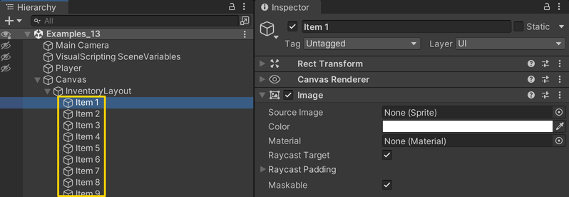
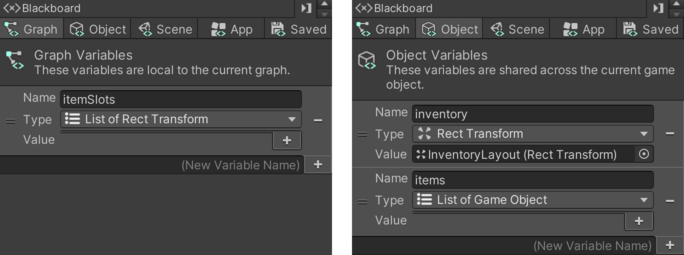

# 13. Inventory

> Using **Unity 2021.3.27f1** and **Visual Scripting 1.8.0**. The project is using the **2D Core** template.

Making an inventory requires a number of steps. This example will demonstrate how to make items in the world get into the inventory and how items in the inventory can be used in the world.

I will break down the process into a number of steps.

## Preparing the canvas with items

A `Canvas` is used to create graphics displayed onto the screen rather than in the game world. Often referred to as a graphical user interface (GUI). The `Canvas` will have a number of children that will be slots for items in the inventory. 

To start, add a `Canvas` to the scene with the following settings.

Then, add a game object as a child of the `Canvas` and add an `Image` and `Grid Layout Group` component to it. The `Image` is given a semi-transparent black colour. The `Grid Layout Group` will automatically layout its children. For now, set the following settings.

The last step in preparing the `Canvas`, is to add a number of game objects that we can use as item slots for our inventory. Add as many game objects as you think you will need. Each of the game objects should have an `Image` component.

## World items

Create a game object with a `Sprite Renderer` and `Circle Collider 2D` component. Set the `Circle Collider 2D` as a trigger. Add a script graph with an *Object* variable called `inventorySprite` of type `Sprite`. Add whatever sprite image you want as the icon for your item. In this example, I am reusing the same sprite for both the inventory and the world. Each item needs to be set up separately, but should use the same script graph.

In the script graph, the `Game Object: Find With Tag` node is used to get a reference to the inventory. We will set this up later.

The `Trigger Custom Event` will trigger a `Custom Event` on the *Inventory* that we will add later. It passes itself (`This`) as an argument, and finally disabled itself.

## Item buckets

Once the items have been collected and placed in the inventory, they can be put into special "buckets". The buckets are set up with two colliders, the outer one as a trigger.

The buckets have one *Object* variable called `item` and is of type `Game Object` that should refer to the game object that can be placed inside them. In addition, it has a *Graph* variable named `isPlayerInside` of type `Boolean`.

The item bucket graph uses the `On Trigger Enter 2D` and `On Trigger Exit 2D` events to know whether the *Player* is near as we have seen in the previous examples.

The `On Update` event flow first checks if the *Player* is inside the trigger and whether the `Jump` button is pressed down.

If it is, then it checks the inventory's list of items to see if the item it accepts, is currently in the inventory.

If the item is in the inventory, it will be removed from the inventory and its world item counterpart is reactivated and placed at the same position as the bucket. Remember that each item has a world-object and an inventory-object.

## The inventory

The last script graph to make, is the inventory itself. Since we are finding the *Inventory* game object by its tag, you must change its tag to `Inventory`.

Before we dive in, let's get a brief overview of what the inventory needs to do:

- It must get a list of all the *Item* game objects in the `Canvas`.
- It should be able to respond to the `AddItem` and `RemoveItem` events, which in turn should add/remove items of its own `items` list.
- It must show a sprite for any item currently in its `items` list.

The *Inventory* has two *Object* variables: One called `inventory` of type `Rect Transform` which should be set to the game object in the `Canvas` that contains all the item slots. The second variables is called `items` and is of type `List of Game Objects`. The value of `items` will be set in the graph, but we make it an *Object* variable because other script graphs need access to it.

In addition to the two *Object* variables, we will also need a *Graph* variable called `itemSlots` of type `List of Rect Transform`. This list will store all the items in the `Canvas`. 

`On Start` we first get a list of all the `Rect Transform` children of the `inventory` inside the `Canvas`. Then we do a funny thing where we remove the `inventory` because we are only interested in its children: the items. `Get Components In Children` oddly enough includes components on the object itself, so its name is a bit misleading. We then save the list to the `itemSlots` variable and then loop through and disable each item.

The next part of the *Inventory* graph are the `Custom Event` nodes that handle adding and removing items. Remember these events are triggered by the items in the world as well as the item buckets. At the end of their flow, they trigger an event called `UpdateItems`, which we will add next.

The `Custom Event` called `UpdateItems` initially loops through each item in the `Canvas` and disables it. We do this to start fresh.

Then it uses a `For Loop` to *iterate* through two lists at the same time: `itemSlots` and `items`. How many `itemSlots` items it loops through depends on the number of items in the `items` list (sorry about the use of the word *item*). 

The sprite referenced in `inventorySprite` on the world item is then assigned to the `Image` of the item in the inventory and the inventory item is finally enabled. 

---

The fruit emojis are designed by [OpenMoji](https://openmoji.org) – the open-source emoji and icon project. License: [CC BY-SA 4.0](https://creativecommons.org/licenses/by-sa/4.0)
