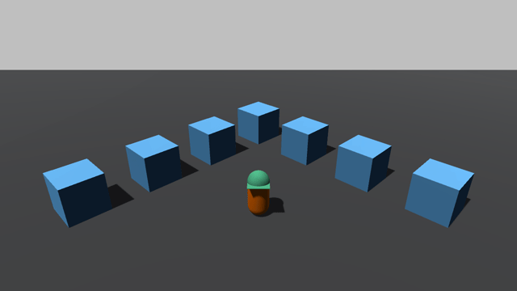
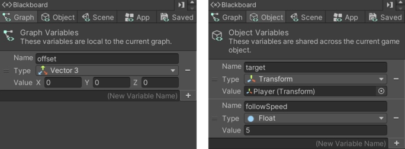
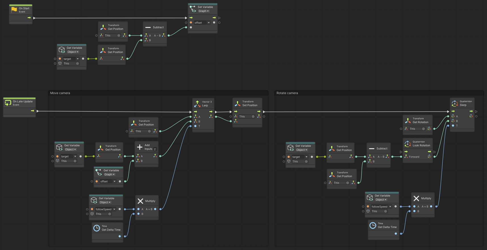

# Camera Follow

> Using **Unity 2021.3.27f1** and **Visual Scripting 1.8.0**. The project is using the **2D Core** template.

Download the graph: [CameraFollow.asset](./CameraFollow.asset)

A basic camera follow script that will move with and look at the `target`.

If you want to use this script in 2D games, you should remove the rotation.

