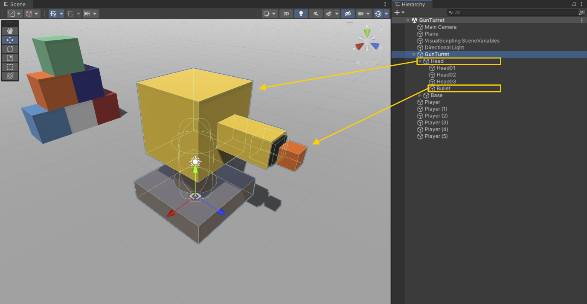
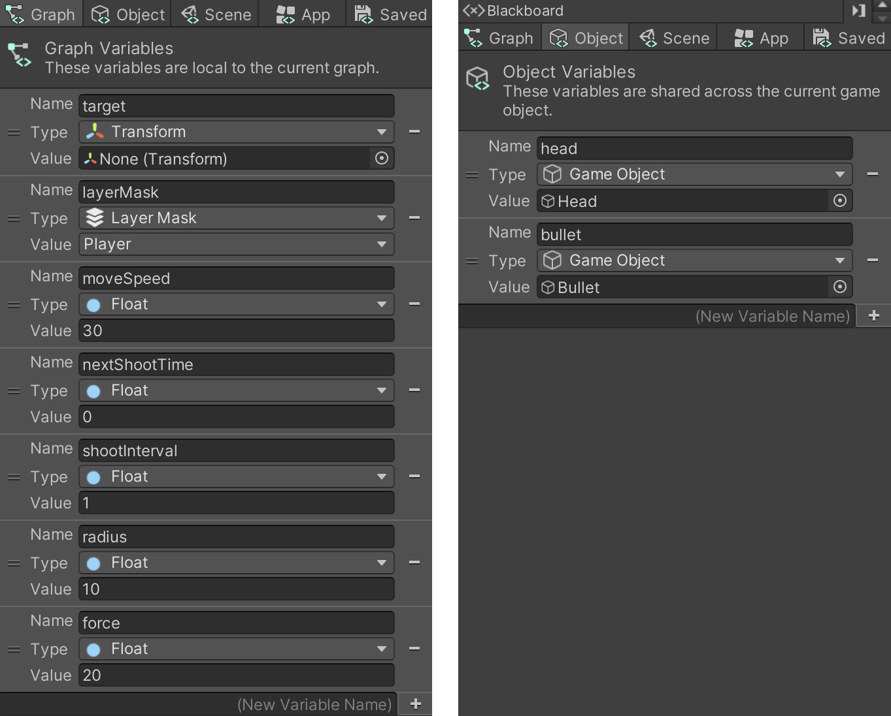
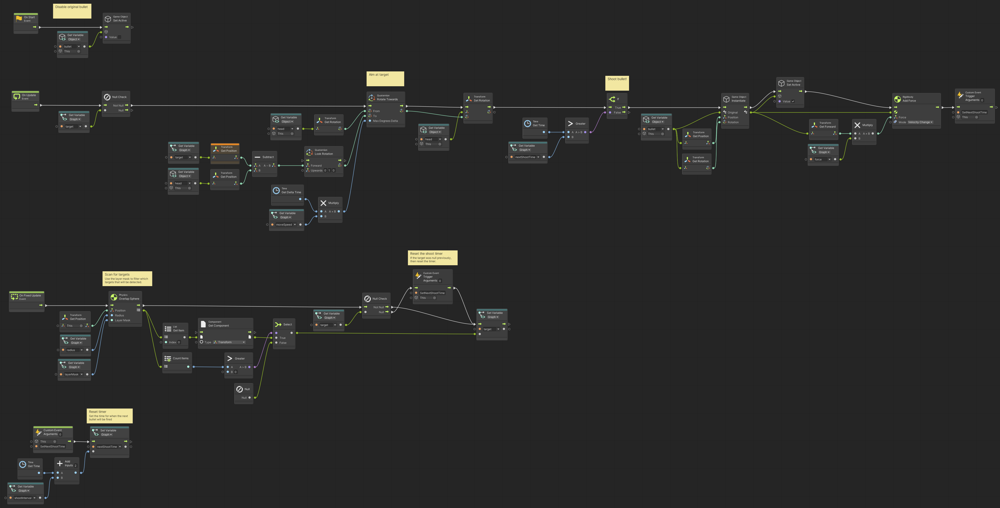

# Gun Turret

> Using **Unity 2021.3.27f1** and **Visual Scripting 1.8.0**. The project is using the **2D Core** template.

<video autoplay loop muted playsinline controls style="width: 100%;">
	<source src="./demo.mp4" type="video/mp4">
</video>

Download the graph: [GunTurret.asset](./GunTurret.asset)

The gun turret is composed of a few parts that needs explanation for the script to work properly. 

The `Gun Turret` game object, is just an empty game object. 

The `Head` is a child of the `Gun Turret` and should be facing in its local Z direction (Unity's forward). 

The `Bullet` should be a child of the `Head` and should also be facing forward - local Z. The bullet has a `Collider` and a `Rigidbody`, since we will let the physics simulation handle the bullet once it is fired. The mass of the bullet is higher than the cubes, to make a bigger impact.

In addition, the script uses a `Layer Mask` to filter which game objects it detects. In this example, the stacked cubes are set to the `Player` layer (you need to add this yourself). You can use any layer you would like, just be sure to also set it in the Graph variables.

