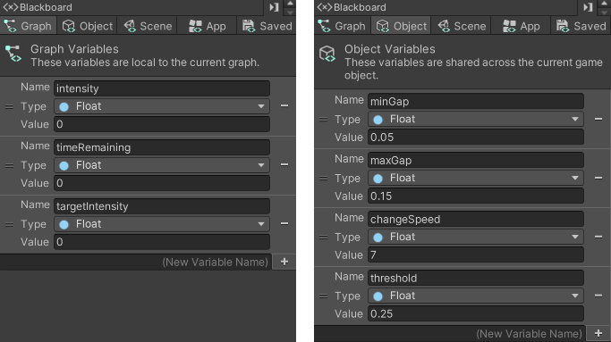
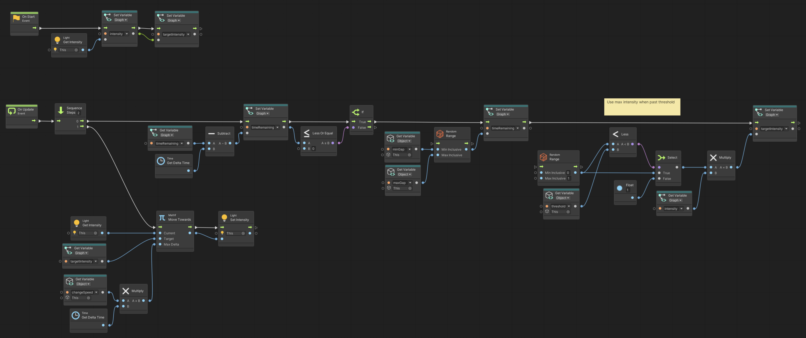

# Light Flicker

> Using **Unity 2021.3.27f1** and **Visual Scripting 1.8.0**. The project is using the **2D Core** template.

<video autoplay loop muted playsinline controls style="width: 100%;">
	<source src="./demo.mp4" type="video/mp4">
</video>

Download the graph: [LightFlicker.asset](./LightFlicker.asset)

A flickering light script with a simple linear transition between values. 

It works by picking a random value every time a timer runs out defined by `minGap` and `maxGap`. If the value is greater than the `threshold` then the light will move towards its full intensity, otherwise it will use the value as an intensity factor.

