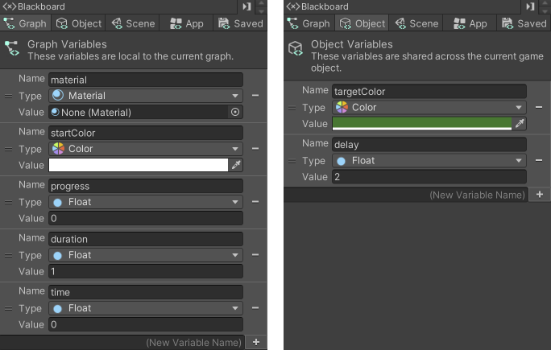
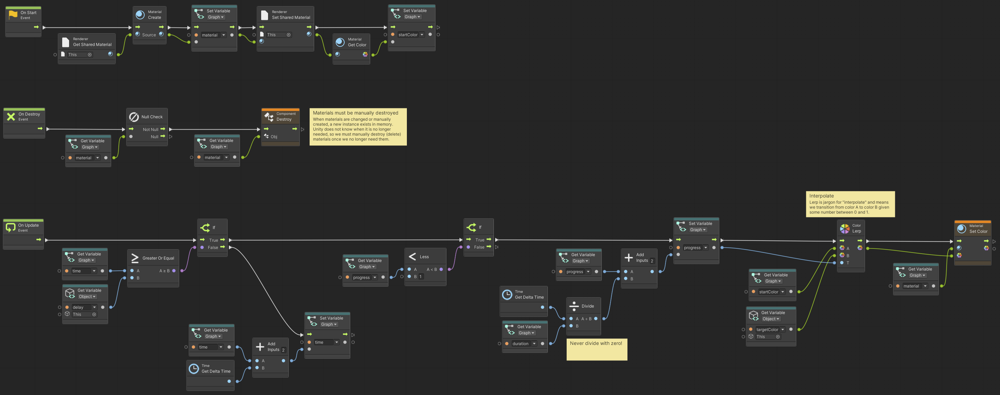

# Material Animation

> Using **Unity 2021.3.27f1** and **Visual Scripting 1.8.0**. The project is using the **2D Core** template.

<video autoplay loop muted playsinline controls style="width: 100%;">
	<source src="./demo.mp4" type="video/mp4">
</video>

Download the graph: [MaterialAnimation.asset](./MaterialAnimation.asset)

A basic material color transition. It starts at its current color and transitions to the `targetColor`.

