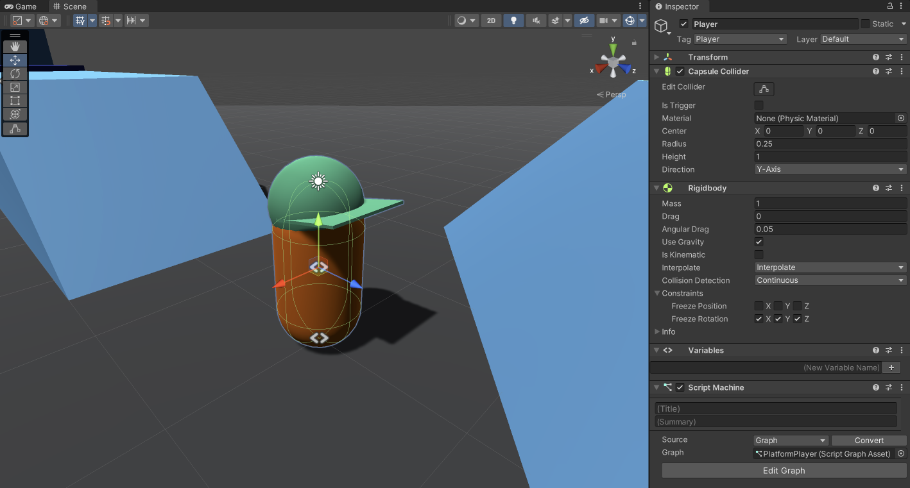
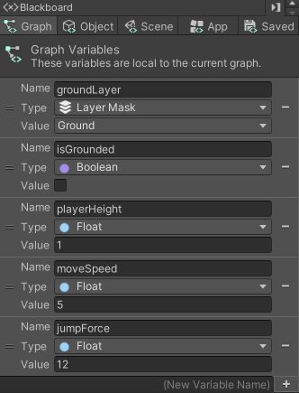
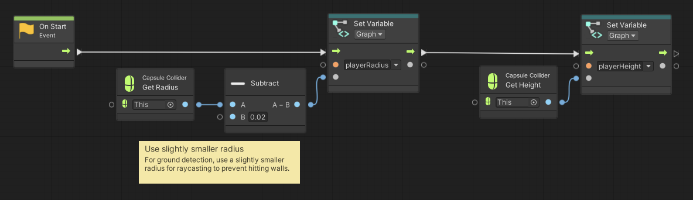
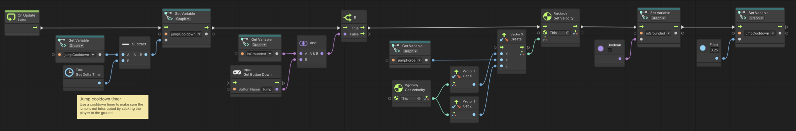
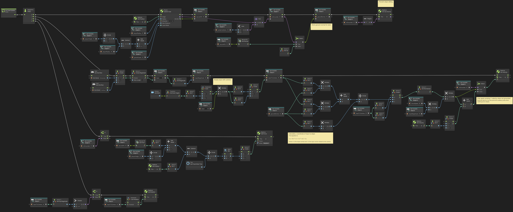

# Platform Player

> Using **Unity 2021.3.27f1** and **Visual Scripting 1.8.0**. The project is using the **2D Core** template.

<video autoplay loop muted playsinline controls style="width: 100%;">
	<source src="./demo.mp4" type="video/mp4">
</video>

Download the graph: [PlatformPlayer.asset](./PlatformPlayer.asset)

A minimal player controller script for simple platforming. It supports walking on slopes and jumping.

Most of the complexity in this graph comes from better handling slope movement and jumping. It is possible to extract some more simple ideas from this graph, like how to orient the game controller input to the camera.

However, I think this can serve as a decent starting point for building your own player controller.

## Player setup

The player is set up with a `Capsule Collider` and a `Rigidbody`. Freeze Rotation is enabled on all three axes. For smoother movement, interpolation is enabled as well.

## Variables

A few variables are used to store the current state of the player controller. An important note is that the player will only be considered grounded on objects that match the `groundLayer` - this can be set to multiple layers, but I do recommend to separate at least walls and ground.

## Graph

I have separated the graph into three images, though they are all part of the same script graph.

### On Start

### On Update

### On Fixed Update

In order to calculate the slope direction in accordance with the game controller input, we need to perform a number of steps.

1. Create a vector from the controller input and clamp it to `1.0`.
2. Rotate the input around the Y-axis to match the camera's view.
3. Get the ground's normal vector from the raycast.
4. Calculate a direction along the ground/slope that keeps the XZ-direction but modifies Y. For this, we can use the equation: <svg xmlns="http://www.w3.org/2000/svg" width="182.840px" height="40.544px" viewBox="0 -1259 10101.9 2240" xmlns:xlink="http://www.w3.org/1999/xlink" aria-hidden="true"><defs><path id="MJX-4-TEX-I-1D463" d="M173 380Q173 405 154 405Q130 405 104 376T61 287Q60 286 59 284T58 281T56 279T53 278T49 278T41 278H27Q21 284 21 287Q21 294 29 316T53 368T97 419T160 441Q202 441 225 417T249 361Q249 344 246 335Q246 329 231 291T200 202T182 113Q182 86 187 69Q200 26 250 26Q287 26 319 60T369 139T398 222T409 277Q409 300 401 317T383 343T365 361T357 383Q357 405 376 424T417 443Q436 443 451 425T467 367Q467 340 455 284T418 159T347 40T241 -11Q177 -11 139 22Q102 54 102 117Q102 148 110 181T151 298Q173 362 173 380Z"></path><path id="MJX-4-TEX-I-1D466" d="M21 287Q21 301 36 335T84 406T158 442Q199 442 224 419T250 355Q248 336 247 334Q247 331 231 288T198 191T182 105Q182 62 196 45T238 27Q261 27 281 38T312 61T339 94Q339 95 344 114T358 173T377 247Q415 397 419 404Q432 431 462 431Q475 431 483 424T494 412T496 403Q496 390 447 193T391 -23Q363 -106 294 -155T156 -205Q111 -205 77 -183T43 -117Q43 -95 50 -80T69 -58T89 -48T106 -45Q150 -45 150 -87Q150 -107 138 -122T115 -142T102 -147L99 -148Q101 -153 118 -160T152 -167H160Q177 -167 186 -165Q219 -156 247 -127T290 -65T313 -9T321 21L315 17Q309 13 296 6T270 -6Q250 -11 231 -11Q185 -11 150 11T104 82Q103 89 103 113Q103 170 138 262T173 379Q173 380 173 381Q173 390 173 393T169 400T158 404H154Q131 404 112 385T82 344T65 302T57 280Q55 278 41 278H27Q21 284 21 287Z"></path><path id="MJX-4-TEX-N-3D" d="M56 347Q56 360 70 367H707Q722 359 722 347Q722 336 708 328L390 327H72Q56 332 56 347ZM56 153Q56 168 72 173H708Q722 163 722 153Q722 140 707 133H70Q56 140 56 153Z"></path><path id="MJX-4-TEX-N-2212" d="M84 237T84 250T98 270H679Q694 262 694 250T679 230H98Q84 237 84 250Z"></path><path id="MJX-4-TEX-I-1D45B" d="M21 287Q22 293 24 303T36 341T56 388T89 425T135 442Q171 442 195 424T225 390T231 369Q231 367 232 367L243 378Q304 442 382 442Q436 442 469 415T503 336T465 179T427 52Q427 26 444 26Q450 26 453 27Q482 32 505 65T540 145Q542 153 560 153Q580 153 580 145Q580 144 576 130Q568 101 554 73T508 17T439 -10Q392 -10 371 17T350 73Q350 92 386 193T423 345Q423 404 379 404H374Q288 404 229 303L222 291L189 157Q156 26 151 16Q138 -11 108 -11Q95 -11 87 -5T76 7T74 17Q74 30 112 180T152 343Q153 348 153 366Q153 405 129 405Q91 405 66 305Q60 285 60 284Q58 278 41 278H27Q21 284 21 287Z"></path><path id="MJX-4-TEX-I-1D465" d="M52 289Q59 331 106 386T222 442Q257 442 286 424T329 379Q371 442 430 442Q467 442 494 420T522 361Q522 332 508 314T481 292T458 288Q439 288 427 299T415 328Q415 374 465 391Q454 404 425 404Q412 404 406 402Q368 386 350 336Q290 115 290 78Q290 50 306 38T341 26Q378 26 414 59T463 140Q466 150 469 151T485 153H489Q504 153 504 145Q504 144 502 134Q486 77 440 33T333 -11Q263 -11 227 52Q186 -10 133 -10H127Q78 -10 57 16T35 71Q35 103 54 123T99 143Q142 143 142 101Q142 81 130 66T107 46T94 41L91 40Q91 39 97 36T113 29T132 26Q168 26 194 71Q203 87 217 139T245 247T261 313Q266 340 266 352Q266 380 251 392T217 404Q177 404 142 372T93 290Q91 281 88 280T72 278H58Q52 284 52 289Z"></path><path id="MJX-4-TEX-N-22C5" d="M78 250Q78 274 95 292T138 310Q162 310 180 294T199 251Q199 226 182 208T139 190T96 207T78 250Z"></path><path id="MJX-4-TEX-N-2B" d="M56 237T56 250T70 270H369V420L370 570Q380 583 389 583Q402 583 409 568V270H707Q722 262 722 250T707 230H409V-68Q401 -82 391 -82H389H387Q375 -82 369 -68V230H70Q56 237 56 250Z"></path><path id="MJX-4-TEX-I-1D467" d="M347 338Q337 338 294 349T231 360Q211 360 197 356T174 346T162 335T155 324L153 320Q150 317 138 317Q117 317 117 325Q117 330 120 339Q133 378 163 406T229 440Q241 442 246 442Q271 442 291 425T329 392T367 375Q389 375 411 408T434 441Q435 442 449 442H462Q468 436 468 434Q468 430 463 420T449 399T432 377T418 358L411 349Q368 298 275 214T160 106L148 94L163 93Q185 93 227 82T290 71Q328 71 360 90T402 140Q406 149 409 151T424 153Q443 153 443 143Q443 138 442 134Q425 72 376 31T278 -11Q252 -11 232 6T193 40T155 57Q111 57 76 -3Q70 -11 59 -11H54H41Q35 -5 35 -2Q35 13 93 84Q132 129 225 214T340 322Q352 338 347 338Z"></path></defs><g stroke="currentColor" fill="currentColor" stroke-width="0" transform="scale(1,-1)"><g data-mml-node="math"><g data-mml-node="msub"><g data-mml-node="mi"><use data-c="1D463" xlink:href="#MJX-4-TEX-I-1D463"></use></g><g data-mml-node="TeXAtom" transform="translate(518,-150) scale(0.707)" data-mjx-texclass="ORD"><g data-mml-node="mi"><use data-c="1D466" xlink:href="#MJX-4-TEX-I-1D466"></use></g></g></g><g data-mml-node="mo" transform="translate(1192.3,0)"><use data-c="3D" xlink:href="#MJX-4-TEX-N-3D"></use></g><g data-mml-node="mo" transform="translate(2248,0)"><use data-c="2212" xlink:href="#MJX-4-TEX-N-2212"></use></g><g data-mml-node="mstyle" transform="translate(3026,0)"><g data-mml-node="mfrac"><g data-mml-node="mrow" transform="translate(220,676)"><g data-mml-node="msub"><g data-mml-node="mi"><use data-c="1D45B" xlink:href="#MJX-4-TEX-I-1D45B"></use></g><g data-mml-node="TeXAtom" transform="translate(633,-150) scale(0.707)" data-mjx-texclass="ORD"><g data-mml-node="mi"><use data-c="1D465" xlink:href="#MJX-4-TEX-I-1D465"></use></g></g></g><g data-mml-node="mo" transform="translate(1309.7,0)"><use data-c="22C5" xlink:href="#MJX-4-TEX-N-22C5"></use></g><g data-mml-node="msub" transform="translate(1809.9,0)"><g data-mml-node="mi"><use data-c="1D463" xlink:href="#MJX-4-TEX-I-1D463"></use></g><g data-mml-node="TeXAtom" transform="translate(518,-150) scale(0.707)" data-mjx-texclass="ORD"><g data-mml-node="mi"><use data-c="1D465" xlink:href="#MJX-4-TEX-I-1D465"></use></g></g></g><g data-mml-node="mo" transform="translate(3004.6,0)"><use data-c="2B" xlink:href="#MJX-4-TEX-N-2B"></use></g><g data-mml-node="msub" transform="translate(4004.8,0)"><g data-mml-node="mi"><use data-c="1D45B" xlink:href="#MJX-4-TEX-I-1D45B"></use></g><g data-mml-node="TeXAtom" transform="translate(633,-150) scale(0.707)" data-mjx-texclass="ORD"><g data-mml-node="mi"><use data-c="1D467" xlink:href="#MJX-4-TEX-I-1D467"></use></g></g></g><g data-mml-node="mo" transform="translate(5238.8,0)"><use data-c="22C5" xlink:href="#MJX-4-TEX-N-22C5"></use></g><g data-mml-node="msub" transform="translate(5739.1,0)"><g data-mml-node="mi"><use data-c="1D463" xlink:href="#MJX-4-TEX-I-1D463"></use></g><g data-mml-node="TeXAtom" transform="translate(518,-150) scale(0.707)" data-mjx-texclass="ORD"><g data-mml-node="mi"><use data-c="1D467" xlink:href="#MJX-4-TEX-I-1D467"></use></g></g></g></g><g data-mml-node="msub" transform="translate(3023.2,-686)"><g data-mml-node="mi"><use data-c="1D45B" xlink:href="#MJX-4-TEX-I-1D45B"></use></g><g data-mml-node="TeXAtom" transform="translate(633,-150) scale(0.707)" data-mjx-texclass="ORD"><g data-mml-node="mi"><use data-c="1D466" xlink:href="#MJX-4-TEX-I-1D466"></use></g></g></g><rect width="6835.9" height="60" x="120" y="220"></rect></g></g></g></g></svg>
5. Normalize the direction and use the input magnitude and `moveSpeed` to determine to velocity along the ground.

