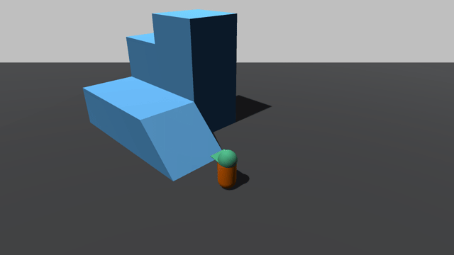
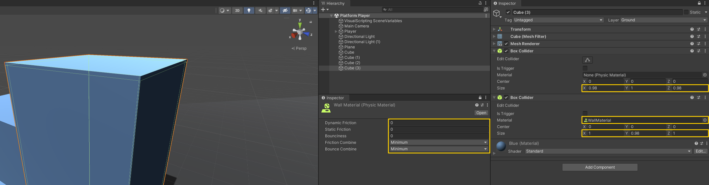
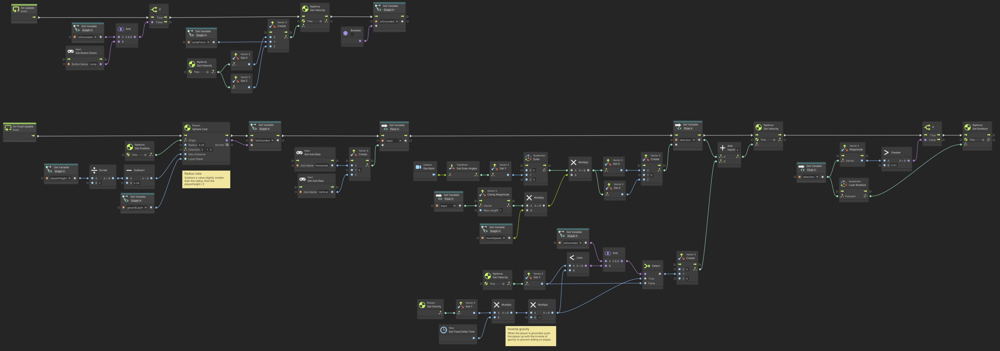

# Platform Player

> Using **Unity 2021.3.27f1** and **Visual Scripting 1.8.0**. The project is using the **2D Core** template.

A player controller for use in platform games. The script is far from production-ready, but should allow you to create some prototypes.

To prevent the player sticking to walls, a `Physics Material` has been assigned with a friction of `0`. So you need separate colliders for the top of the platform and the sides/walls.

Some of the values in the graph will need to be tweaked to fit your character. For example the `Physics: Sphere Cast` radius.

